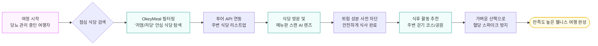
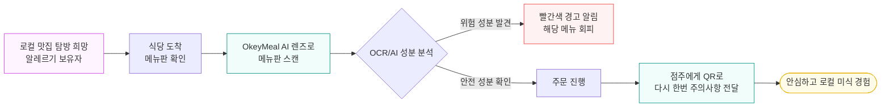

# 👥 타겟 페르소나 정의서

2026 관광데이터 공모전 지정과제 5번(만성질환자의 외식 불안감 해소)에 초점을 맞추어, OkeyMeal(오키밀)의 핵심 사용자를 재정의하고 고객 여정(Customer Journey)을 설계합니다.

> **💡 핵심 타겟 재정의 (과제 5번 기준)**
> *   **1차 타겟 (Primary)**: 당뇨, 고혈압 등 기저질환(만성질환)을 앓고 있는 내/외국인 관광객
> *   **2차 타겟 (Secondary)**: 알레르기, 종교적/윤리적 신념 등으로 특정 식이 제한이 있는 관광객
> *   **파트너 (Partner)**: 디지털 전환이 필요한 지역 소상공인 식당 점주

---

## 1. 1차 핵심 타겟: 만성질환자 (당뇨 및 고혈압 관리)

### 페르소나 프로필: 다나카 (Tanaka)
| 항목 | 내용 |
| --- | --- |
| 인적사항 | 68세, 국적: 일본, 직업: 은퇴 공무원, **기저질환: 제2형 당뇨 및 고혈압** |
| Pain Point | 맵고 짠 한국 음식 특성상 당류/나트륨 수치를 알 수 없어 외식이 망설여짐. 식후 혈당이 치솟을까 봐 걱정되어 식사 후 쉴 곳이나 가볍게 걸을 곳을 항상 고민함. 외국어 서비스 부족으로 식재료나 조리 방식 변경 요청이 불가능함. |
| Needs | 한국관광공사 및 식약처 데이터를 활용해 검증된 '저당/저염 안심 식당' 추천. 식사 직후 혈당 관리를 위해 가볍게 걸을 수 있는 주변 명소나 산책 코스 정보 제공. |

### 🗺 고객 여정 지도 (Customer Journey Map)

---

## 2. 2차 핵심 타겟: 식이 제한자 (알레르기 보유자)

### 페르소나 프로필: 마크 (Mark)
| 항목 | 내용 |
| --- | --- |
| 인적사항 | 32세, 국적: 미국, 직업: 소프트웨어 엔지니어, **식이제한: 땅콩 및 견과류 알레르기 (치명적)** |
| Pain Point | 양념장이나 반찬에 숨겨진 견과류 성분을 확인할 길이 없음. 사장님께 영어로 물어봐도 소통 오류가 발생할까 봐 극심한 공포를 느낌. 이로 인해 한국 로컬 맛집 방문을 포기하고 프랜차이즈 식당만 찾음. |
| Needs | 메뉴판만 스캔해도 알레르기 유발 성분을 다국어로 번역해 주고 경고해 주는 AI 렌즈. 응급 상황(아나필락시스) 발생 시 외국어 진료가 가능한 주변 응급실/병원 SOS 연계. |

### 🗺 고객 여정 지도 (Customer Journey Map)

---

## 3. 파트너: 디지털 취약계층 소상공인 점주

### 페르소나 프로필: 고순자 (Ko Soon-ja)
| 항목 | 내용 |
| --- | --- |
| 인적사항 | 61세, 국적: 한국, 직업: 제주 로컬 식당 운영 (22년 경력), **특징: 디지털 리터러시 부족** |
| Pain Point | 외국인 관광객이 늘어나면서 "Is this Halal?"이나 "No Peanut?" 같은 질문을 받지만, 영어를 못해 소통이 단절됨. 비싼 돈을 주고 다국어 메뉴판이나 키오스크를 도입할 의향이 없음. |
| Needs | 앱 설치나 복잡한 가입 절차 없이, 기존에 사용하는 카카오톡 수준의 직관적인 웹 알림(FCM)으로 외국인 손님의 식이 제약 정보를 한국어로 요약해서 알려주는 기능. |

---

## 📝 변경 이력
| 버전 | 날짜 | 변경 내용 | 작성자 |
|---|---|---|---|
| v2.0.0 | 2026-07-08 | 공모전 지정과제 5번 템플릿에 맞추어 페르소나 재정의 및 여정 지도(Mermaid) 추가 | 숭늉 |
