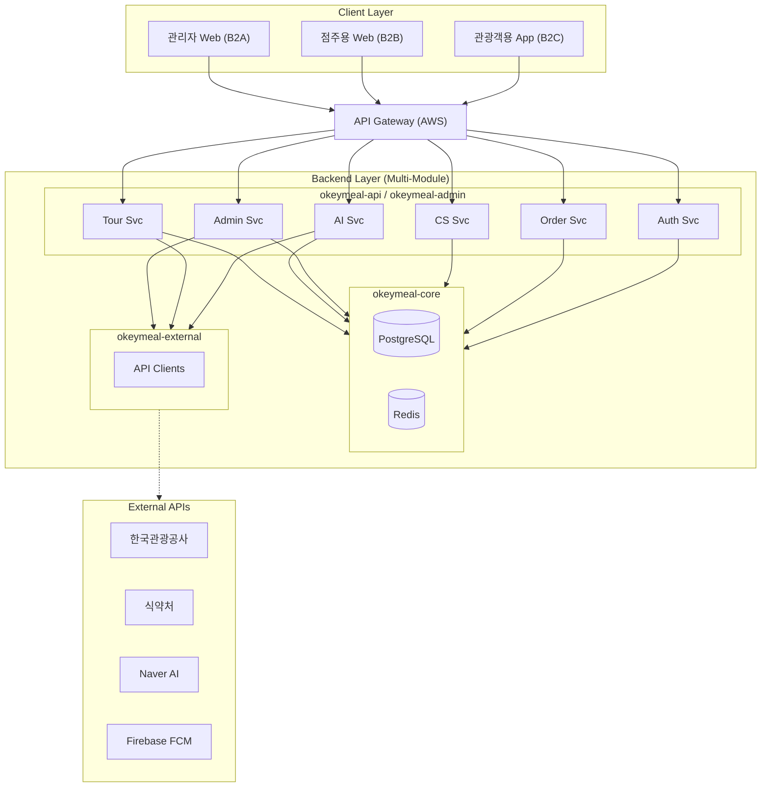
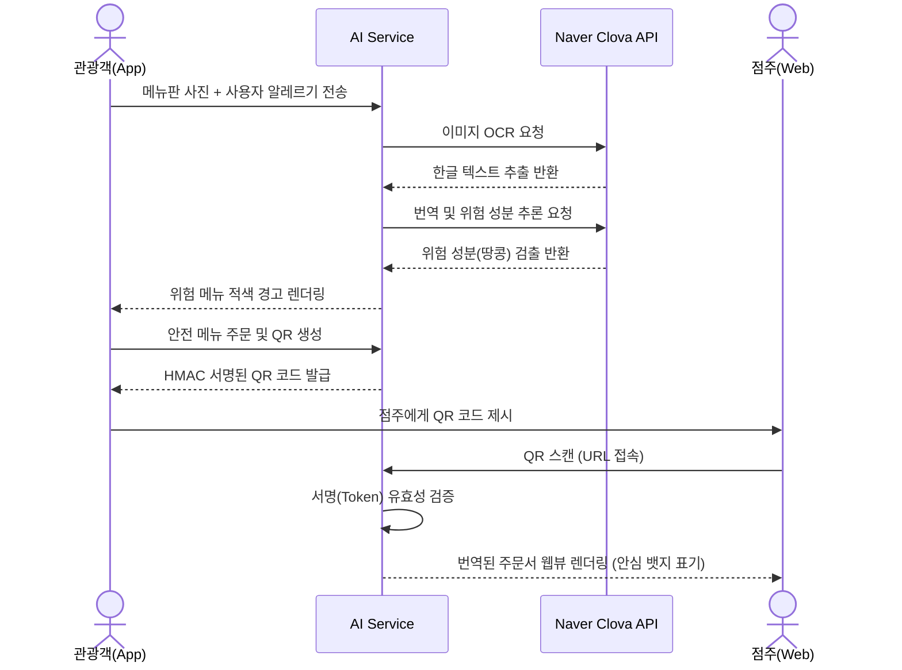

# 🏗️ OkeyMeal 서비스 구조도 (Architecture)

본 문서는 OkeyMeal 프로젝트의 프론트엔드 및 백엔드의 계층 구조, 패키지/폴더 명세, 그리고 AI API 연동 전략을 상세히 정의합니다.

---

## 1. 핵심 기술 스택 (Core Tech Stack)

**[프론트엔드]**
*   **프레임워크**: React 19.2.7 + Vite
*   **상태 관리**: Zustand (전역 클라이언트 상태), React Query (서버 상태 캐싱)
*   **스타일링**: Vanilla CSS Modules

**[백엔드]**
*   **프레임워크**: Spring Boot 4.1.0 + OpenJDK 25
*   **데이터베이스**: PostgreSQL (JSONB, PostGIS 연동) + Redis (세션/QR 캐싱)
*   **ORM**: Spring Data JPA
*   **비동기 처리**: Virtual Threads (AI API 통신 대기 병목 해결)

---

## 2. 프로젝트 폴더 및 패키지 구조 (Directory Structure)

### 2.1. 프론트엔드: FSD (Feature-Sliced Design) 아키텍처
기능(도메인) 중심으로 UI, 비즈니스 로직, 상태를 응집하여 관리합니다. B2C(관광객), B2B(점주), B2A(관리자) 뷰를 모듈화합니다.

```text
src/
 ├── app/             # 전역 라우터(React Router), 프로바이더(QueryClient), 글로벌 스타일
 ├── assets/          # 공통 폰트, 로고 이미지, 글로벌 CSS
 ├── features/        # 도메인 중심의 핵심 기능 모듈 모음
 │    ├── auth/       # 프로필 설정, 21종 알레르기 온보딩 (컴포넌트, 상태, 훅)
 │    ├── scanner/    # AI 렌즈 카메라 뷰, OCR 결과 상태 관리 (Zustand)
 │    ├── order/      # 점주용 스마트 오더 뷰어 및 QR 스캔 처리
 │    ├── tour/       # 무장애 식당 지도 뷰, 리뷰 필터링 로직
 │    ├── cs/         # [신규] 게시판, FAQ, 1:1 문의, 개인정보 동의 UI
 │    └── admin/      # [신규] 관리자용 통계 대시보드 및 회원 관리 패널
 ├── shared/          # 공통 컴포넌트(Button, Modal), 암호화 유틸, API 클라이언트(Axios)
 └── App.jsx          # 루트 컴포넌트
```

### 2.2. 백엔드: 계층형 멀티 모듈 (Layered Multi-Module) 아키텍처
마이크로서비스(MSA) 전환이 용이하고 모듈 간 결합도를 낮추기 위해 Gradle Multi-Module 방식을 채택합니다.

```text
okeymeal-backend/
 ├── okeymeal-core/          # [의존성 없음] 핵심 비즈니스 로직 및 인프라
 │    ├── domain/            # user, tour, ai, order, cs 등 도메인별 JPA Entity 및 Repository
 │    └── global/            # 공통 예외 처리, 보안(Security/JWT), 공통 유틸리티
 │
 ├── okeymeal-external/      # [의존성: core] 외부 API 통신 전용 클라이언트
 │    ├── ai/                # Spring AI 기반 HyperCLOVA X 및 Clova OCR 연동 모듈
 │    └── tour/              # 한국관광공사 TourAPI, Google Places API 연동 모듈
 │
 ├── okeymeal-api/           # [의존성: core, external] 관광객(B2C) 및 점주(B2B)용 REST API
 │    ├── controller/        # 프론트엔드 앱과 통신하는 엔드포인트
 │    └── dto/               # API 요청/응답 객체 매핑
 │
 └── okeymeal-admin/         # [의존성: core] 관리자(B2A) 전용 API 및 배치 처리
      ├── stats/             # 일간 스캔량, QR 발급량, 주문 트렌드 집계 스케줄러
      └── controller/        # 관리자 대시보드용 데이터 제공 엔드포인트
```

---

## 3. ORM 및 DB 최적화 전략 (JPA vs MyBatis)

OkeyMeal은 빠르고 안전한 도메인 확장을 위해 **Spring Data JPA를 메인 ORM으로 채택**했습니다.

*   **JPA 도입 사유**: OkeyMeal은 레거시 DB가 없는 신규 프로젝트이며, `User`, `Review`, `Post`, `Inquiry` 등 엔티티 간의 연관관계가 명확합니다. 객체 지향적인 설계와 CRUD 생산성이 압도적으로 높아 스타트업 및 해커톤 환경에 최적화되어 있습니다.
*   **보완 전략 (QueryDSL/Native Query)**: 
    *   반경 5km 식당 조회를 위한 **PostGIS 공간 연산 쿼리** 등 복잡도가 높은 로직은 Native Query를 활용합니다.
    *   관리자 모듈의 **대용량 조인 및 통계 분석(FEAT-ADMIN-02)** 은 QueryDSL을 활용해 Type-Safe하고 최적화된 쿼리를 구성합니다.

---

## 4. AI API 통신 대안 비교 및 확정

*   **1안 (Google Vision + Gemini)**: 가격이 저렴하고 희귀 언어 번역에 강하나, K-Food의 핵심인 **'노포 식당의 세로쓰기/손글씨 메뉴판'** 인식률에서 치명적인 오독 리스크가 존재.
*   **2안 (Naver Clova OCR + HyperCLOVA X)**: 비용이 다소 높으나, **압도적인 한글 OCR 성능**과 한국 식문화 뉘앙스 파악 능력을 지님. 심사위원 시연 시 오류를 최소화하기 위해 **2안을 최종 채택**.

---

## 5. 데이터 흐름 요약 (Data Flow)

1. **관광객 AI 렌즈 구동**: React 카메라 뷰 -> 이미지 압축 -> `okeymeal-api` 서버로 전송.
2. **비동기 AI 연동**: API 서버는 Virtual Threads를 사용하여 블로킹 없이 `okeymeal-external`의 Naver OCR / LLM 연동 모듈을 호출.
3. **위험 성분 분석**: 추출된 한글 메뉴명을 사용자의 알레르기 DB(JPA)와 대조하여 위험 성분 필터링 및 번역.
4. **결과 반환 및 렌더링**: 프론트엔드에 JSON 반환, React에서 위험 메뉴 붉은색 AR 오버레이 렌더링.
5. **통계 적재 (Admin)**: 비동기 이벤트 리스너를 통해 해당 스캔 이력을 `okeymeal-admin` 통계 DB로 적재하여 추후 AI 파인튜닝 자료로 활용.

---

## 6. 시각화 다이어그램 (Diagrams)

### 6.1. 시스템 구성도 (System Architecture)


### 6.2. 데이터 흐름도 (Data Flow)

