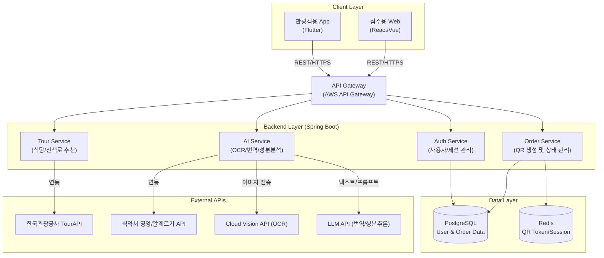
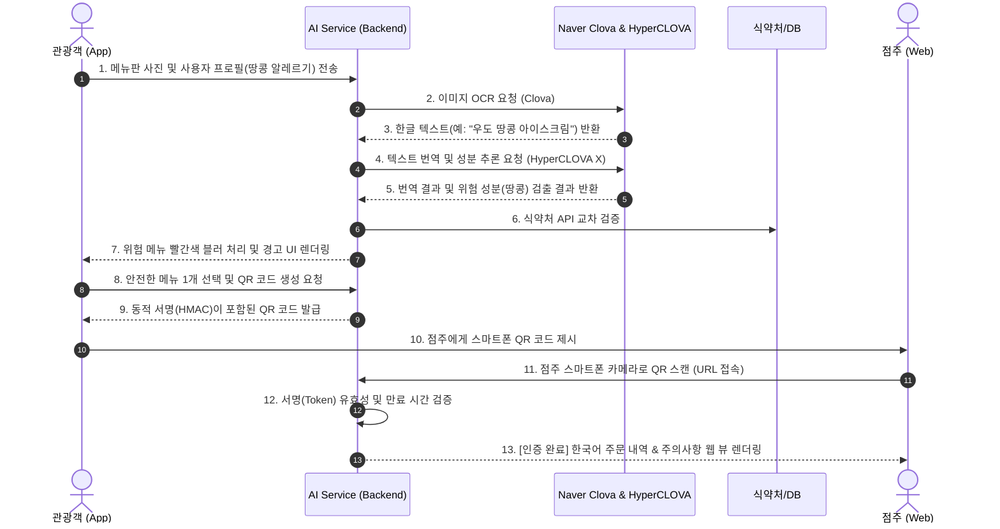

# 🏗️ 서비스 구조도 (Architecture)

본 문서는 OkeyMeal 프로젝트의 전체적인 시스템 구성, 핵심 기술 스택, 데이터 흐름, 그리고 AI 렌즈 기능 구현을 위한 API 조합 대안 분석을 명세합니다.

---

## 1. 시스템 구성도 (System Architecture)

---

## 2. AI 메뉴 스캐너: 핵심 API 조합 대안 비교 분석

사용자가 촬영한 메뉴판 이미지에서 텍스트를 추출하고(OCR), 이를 번역한 뒤, 위험 성분을 추론하는 핵심 로직을 구현하기 위해 두 가지 API 조합 안을 비교 분석합니다.

### 💡 1안: Google 생태계 조합 (Google Cloud Vision + Gemini)
가장 보편적이고 글로벌 호환성이 높은 조합입니다.

*   **장점 (Pros)**
    *   **강력한 다국어 번역**: 유럽, 동남아 등 희귀 언어권 사용자의 자국어 번역 품질이 압도적으로 우수.
    *   **비용 효율성**: 대규모 트래픽 발생 시 API 호출 비용이 상대적으로 저렴함.
    *   **인프라 일관성**: 해외 사용자가 접근할 때 글로벌 엣지(Edge) 네트워크가 잘 구축되어 있어 응답 지연(Latency)이 적음.
*   **단점 (Cons)**
    *   한국 로컬 노포 식당 특유의 **궁서체, 휘갈겨 쓴 손글씨 메뉴판**, 세로 쓰기 메뉴판 등에 대한 한글 OCR 인식률이 네이버 대비 약간 떨어질 수 있음.
    *   한국 로컬 식재료(예: "취나물", "고사리", "다시다")에 대한 깊은 맥락적 이해가 부족할 때가 있음.

### 💡 2안: Naver 생태계 조합 (Naver Clova OCR + HyperCLOVA X)
한국의 로컬 환경과 데이터에 가장 특화된 조합입니다.

*   **장점 (Pros)**
    *   **압도적인 한글 OCR 성능**: 오래된 식당의 손글씨, 세로 간판, 빛 반사가 심한 비닐 코팅 메뉴판 등 악조건 속에서도 한글을 정확하게 추출함.
    *   **로컬 식문화(K-Food) 이해도 최상**: HyperCLOVA X는 "김치찌개에 돼지고기가 기본으로 들어간다"거나 "쌈장에 견과류가 들어갈 수 있다"는 한국 식문화의 숨겨진 맥락을 깊이 이해하여 더 정확한 알레르기 경고가 가능함.
*   **단점 (Cons)**
    *   Google 대비 비용(Cost)이 높게 책정될 수 있음.
    *   영어/일어/중국어 등 메이저 언어 외의 소수 언어 번역 퀄리티 및 레이턴시가 Google보다 불리할 수 있음.

> **📌 최종 제안 (결론)**
> 초기 타겟 시장이 "한국에 방문하는 모든 외국인"이라면 1안(Google)이 무난하나, 과제 5번의 심사위원이 **"한글 메뉴판 인식의 정확도"**와 **"안전성(한국 음식 성분 파악의 치밀함)"**을 중점적으로 볼 것을 고려하면, 공모전 출품작 수준에서는 비용을 감수하더라도 **2안(Naver 조합)**을 채택하여 OCR 인식률 실패로 인한 시연(Demo) 실패 리스크를 없애는 것을 권장합니다.

---

## 3. 데이터 흐름도 (Data Flow Diagram - AI 스캐너 및 QR 오더)

---

## 📝 변경 이력
| 버전 | 날짜 | 변경 내용 | 작성자 |
|---|---|---|---|
| v1.0.0 | 2026-07-08 | 서비스 구조도 최초 작성 (API 조합 대안 비교 분석 추가) | 숭늉 |
