# 🗄️ 데이터베이스 설계서 (DB Schema)

본 문서는 [`Feature_List.md`](./Feature_List.md)의 각 기능에 흩어져 있던 테이블 정의를 단일 ERD로 통합한 데이터베이스 설계서입니다. **PostgreSQL(JSONB·PostGIS) + Redis** 기준이며, 민감 건강정보(PHI)는 AES-256 양방향 암호화(NFR-S02)로 저장합니다.

> ⚠️ **초안(Draft)**: 컬럼 타입·제약조건은 개발 착수 시 Flyway 마이그레이션 V1과 함께 확정합니다. Redis 캐시 대상(`qr_tokens` 등)은 ERD에서 제외합니다.

---

## 1. ERD 시각화

```mermaid
erDiagram
    users ||--|| user_profiles : has
    users ||--o{ user_socials : owns
    users ||--o{ user_consents : agrees
    users ||--o{ reviews : writes
    users ||--o{ scan_logs : generates
    users ||--o{ orders : places
    users ||--o{ posts : writes
    users ||--o{ comments : writes
    users ||--o{ inquiries : submits
    restaurants ||--o{ reviews : receives
    restaurants ||--o{ orders : receives
    posts ||--o{ comments : contains
    terms ||--o{ user_consents : referenced_by

    users {
        bigint id PK
        varchar email
        varchar password
        varchar role "USER|OWNER|ADMIN"
        varchar status "ACTIVE|SUSPENDED|WITHDRAWN"
        timestamp created_at
    }
    user_profiles {
        bigint user_id PK "FK"
        bytea encrypted_health_data "AES-256 (질환·21종 알레르기)"
        varchar language_code
    }
    user_socials {
        bigint id PK
        bigint user_id FK
        varchar provider "google|apple|naver|kakao"
        varchar provider_id
    }
    user_consents {
        bigint id PK
        bigint user_id FK
        bigint terms_id FK
        boolean agreed
        timestamp updated_at
    }
    restaurants {
        bigint id PK
        varchar name
        double lat
        double lng
        jsonb menu_json
        jsonb attributes "무장애·비건·할랄 등"
    }
    reviews {
        bigint id PK
        bigint user_id FK
        bigint restaurant_id FK
        text content
        int rating
    }
    scan_logs {
        bigint id PK
        bigint user_id FK
        varchar scan_type "MENU|BARCODE"
        varchar image_url
        text ocr_result
        boolean warning_flag
    }
    orders {
        bigint id PK
        bigint user_id FK
        bigint restaurant_id FK
        jsonb menu_details
        varchar status
    }
    posts {
        bigint id PK
        bigint user_id FK
        varchar title
        text content
        int likes
    }
    comments {
        bigint id PK
        bigint post_id FK
        bigint user_id FK
        text content
    }
    inquiries {
        bigint id PK
        bigint user_id FK
        varchar type
        text content
        varchar image_url
        varchar status
    }
    terms {
        bigint id PK
        varchar title
        int version
        boolean required
    }
    admin_stats {
        bigint id PK
        date stat_date
        jsonb metrics "스캔량·QR발급·에러율"
    }
    common_codes {
        bigint id PK
        varchar group_code "ALLERGY|DISEASE|INQUIRY_TYPE"
        varchar code
        varchar label
    }
    app_versions {
        bigint id PK
        varchar platform
        varchar version
        boolean force_update
    }
    i18n_messages {
        bigint id PK
        varchar message_key
        varchar lang
        text message
    }
    campaign_banners {
        bigint id PK
        varchar target "HOME|OWNER"
        varchar image_url
        boolean active
    }
```

---

## 2. 테이블 정의서 (요약)

| Table Name | 대표 Column | Type | Description | 연관 기능 |
| --- | --- | --- | --- | --- |
| `users` | role, status | varchar | 통합 회원(관광객/점주/관리자) | FEAT-AUTH-02, FEAT-ADMIN-04 |
| `user_profiles` | encrypted_health_data | bytea | 건강/식이 프로필(AES-256) | FEAT-AUTH-01 |
| `user_socials` | provider | varchar | 소셜 로그인 매핑(4종) | FEAT-AUTH-03 |
| `restaurants` | menu_json, attributes | jsonb | 식당·메뉴·무장애/비건/할랄 속성 | FEAT-TOUR-01 |
| `reviews` | rating | int | 동일 식성 리뷰 | FEAT-TOUR-01 |
| `scan_logs` | scan_type, warning_flag | varchar/bool | 메뉴판·바코드 스캔 이력(AI 재학습) | FEAT-AI-01, FEAT-AI-02, FEAT-ADMIN-02 |
| `orders` | menu_details | jsonb | 스마트 오더 | FEAT-ORDER-01 |
| `posts`·`comments` | - | - | 커뮤니티 게시판 | FEAT-CS-01 |
| `inquiries` | type, status | varchar | 1:1 문의 | FEAT-CS-02, FEAT-ADMIN-03 |
| `user_consents`·`terms` | agreed, version | bool/int | 개인정보 동의 이력(GDPR) | FEAT-CS-03 |
| `admin_stats` | metrics | jsonb | 일자별 통계 집계 | FEAT-ADMIN-01 |
| `common_codes` | group_code | varchar | 동적 공통 코드 | FEAT-ADMIN-05 |
| `app_versions`·`i18n_messages`·`campaign_banners` | - | - | 마스터/다국어/배너 관리 | FEAT-ADMIN-05, FEAT-ADMIN-06 |

> **Redis(비영속)**: `qr_tokens`(QR 임시 토큰), JWT 블랙리스트, 일간 통계 캐시.

---

## 📝 변경 이력
| 버전 | 날짜 | 변경 내용 | 작성자 |
|---|---|---|---|
| v0.1.0 | 2026-07-14 | 최초 골격 작성 — Feature_List 산재 테이블 통합 ERD 및 정의서 초안 | 숭늉 |
