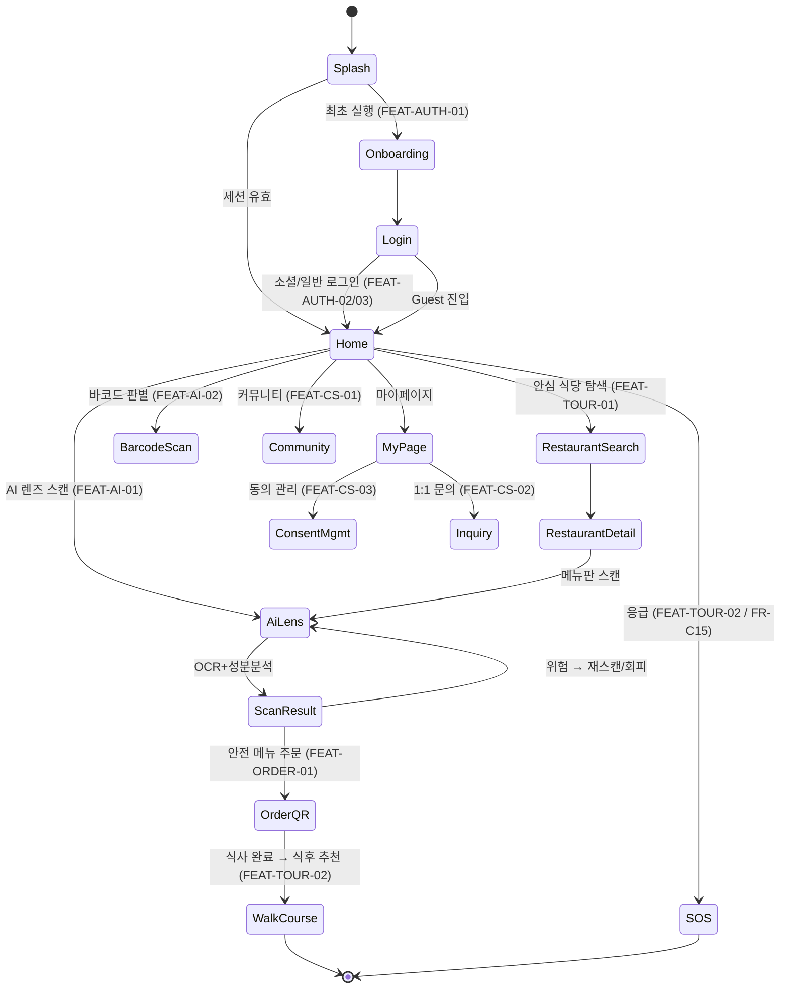

# 🧭 화면 설계 및 유저 플로우 (UI/UX Flow)

본 문서는 OkeyMeal의 주요 화면 흐름과 화면별 컴포넌트·API 트리거를 정의합니다. B2C(관광객 앱)를 중심으로 하며, B2B(점주 웹)·B2A(관리자 웹)는 별도 섹션으로 확장합니다.

> ⚠️ **초안(Draft)**: 와이어프레임/디자인 시안 확정 후 화면별 상세를 보강합니다.

---

## 1. 전체 화면 흐름도 (B2C)

---

## 2. 화면별 상세 요구사항 (요약)

| 화면 | 주요 UI 요소 | API 호출 트리거 |
| --- | --- | --- |
| **Onboarding** | 21종 알레르기/질환 체크리스트, 언어 설정 | `POST /api/v1/auth/profile` |
| **RestaurantSearch** | 지도(PostGIS 5km), 위험도 라벨(적/황/녹), 비건/할랄/무장애 필터 | TourAPI, 지자체 안심식당 API |
| **AiLens (스캐너)** | 카메라 뷰, 로딩 스켈레톤, AR 오버레이(위험 적색), 3초 타임아웃 Fallback | `POST /api/v1/ai/scan` |
| **ScanResult** | 성분 위험 요약, 안전/위험 메뉴 구분, 주문 진행 버튼 | - |
| **OrderQR** | 타이머 동적 QR(HMAC 서명), 안심 뱃지 | `GET /api/v1/order/view/{token}` |
| **WalkCourse** | 반경 2km 걷기 코스/명소, 내비 연동 | TourAPI, Google Maps |
| **SOS** | 최단거리 응급실/심야약국, 다국어 헬프카드, TTS | 보건복지부 응급의료기관 API |
| **MyPage** | 동의 철회, 문의, 프로필 수정 | `PATCH /api/v1/users/consents` |

---

## 3. B2B(점주 웹) / B2A(관리자) 플로우
> ⬜ 작성 예정 — 점주 QR 뷰어·퀵 리플라이 흐름, 관리자 대시보드 내비게이션을 추후 보강.

---

## 📝 변경 이력
| 버전 | 날짜 | 변경 내용 | 작성자 |
|---|---|---|---|
| v0.1.0 | 2026-07-14 | 최초 골격 작성 — B2C 전체 화면 흐름도(State Diagram) 및 화면별 요약 | 숭늉 |
