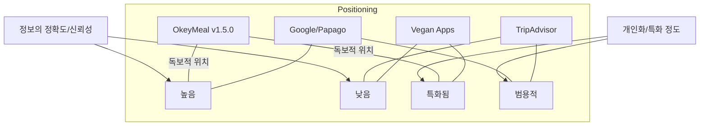

# ⚔️ OkeyMeal 경쟁 서비스 분석 (v1.5.0)

이 문서는 OkeyMeal v1.5.0의 고도화된 기능(RAG 기반 AI, 듀얼 맵, 점주 직결 시스템)을 바탕으로 시장 내 경쟁 우위를 분석합니다.

---

## 1. 확장 경쟁 서비스 비교 분석

| 서비스군 | 대표 서비스 | OkeyMeal과의 결정적 차이 (The Gap) | OkeyMeal의 우위 (v1.5.0) |
|---|---|---|---|
| **범용 번역/비전** | Google Lens, Papago | "성분은 읽지만, 먹어도 되는지는 모름" (단순 번역) | **Fast-Check:** AI가 개인 프로필과 식약처 DB를 대조하여 즉각적인 '안심 신호등' 표시 |
| **로컬 지도/정보** | 네이버 지도, 카카오맵 | "정보는 많지만 외국인에게는 불친절함" (언어 및 상세 필터 부족) | **Dual Map Engine:** 구글맵의 익숙함과 카카오맵의 상세 정보를 결합 + 초개인화 식이 필터링 제공 |
| **글로벌 여행 플랫폼** | TripAdvisor, Yelp | "리뷰는 많지만 실시간 성분 확인은 불가" (과거 데이터 의존) | **Owner Direct Link:** QR을 통한 점주 실시간 확인 및 점주가 직접 관리하는 최신 레시피 데이터 활용 |
| **특화 식이 앱** | HappyCow, V-Label | "특정 그룹(비건 등)에는 강하나 한국 로컬 환경에 취약" | **Jeju/Korea Context:** 한국 특유의 소스(액젓 등)와 숨겨진 성분을 AI가 추론하고 해설 |

---

## 2. OkeyMeal v1.5.0만의 전략적 차별화 포인트

### ① 데이터 신뢰성의 격차: "RAG 기반 4-Layer Fusion"
- **기존 서비스:** 사용자 리뷰나 단순 번역에 의존.
- **OkeyMeal:** [관광공사 + 식약처 + 점주 레시피 + Gemini AI]를 결합. 특히 **RAG(검색 증강 생성)** 기술을 통해 AI의 환각을 방지하고 공신력 있는 데이터 기반의 답변만 제공함.

### ② 소통 방식의 혁신: "QR 기반 Zero-Cost Push"
- **기존 서비스:** 외국인이 직접 한국어로 묻거나, 앱 내 채팅(비쌈/불편) 사용.
- **OkeyMeal:** 점주 관리자용 웹과 연동된 QR 시스템으로 비용 없이 사용자의 식이 정보를 점주에게 즉시 전달. 언어 장벽을 기술적으로 완전히 제거.

### ③ 주최사 시너지 (관광공사 & 카카오)
- **공공성:** 관광공사의 다국어 POI 및 식약처 데이터를 활용하여 공익적 가치 증명.
- **기술성:** 카카오맵 API의 상세 데이터와 카카오의 로컬 인프라를 활용하여 국내 최적화된 경험 제공. (공모전 가산점 포인트)

---

## 3. 포지셔닝 맵 (Positioning Map)

---

## 4. 결론: 왜 OkeyMeal인가?
OkeyMeal은 단순한 '맛집 찾기' 앱이 아닌, **'데이터로 검증된 안전한 미식 경험'**을 제공하는 플랫폼입니다. 특히 점주가 직접 데이터 생성(레시피 입력)에 참여하게 함으로써, 기존 앱들이 해결하지 못한 '실시간 성분 변화' 문제를 해결하는 유일한 솔루션입니다.

---

## 📝 변경 이력
| 버전 | 날짜 | 변경 내용 | 작성자 |
|---|---|---|---|
| v1.0.0 | 2026-04-18 | 최초 경쟁 분석 문서 작성 | 숭늉 |
| v1.1.0 | 2026-04-20 | v1.5.0 아이디어(RAG, 듀얼 맵, QR 시스템) 반영하여 분석 고도화 | 숭늉 |
