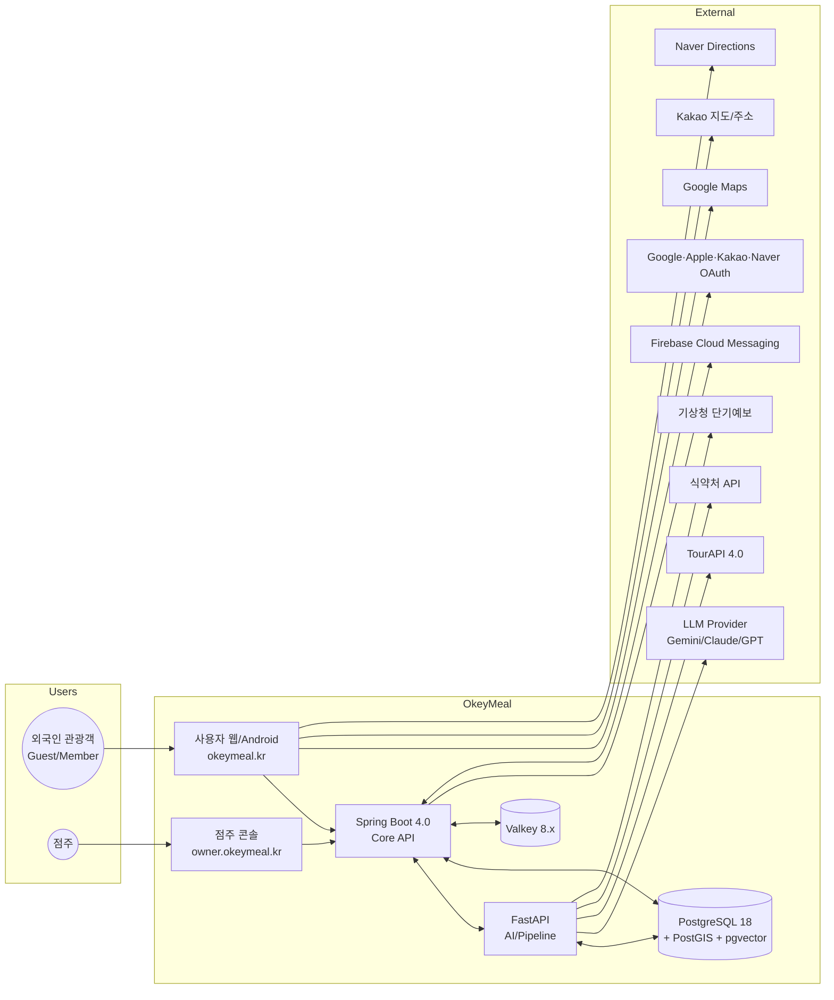

# 📑 OkeyMeal 요구사항 명세서 (Requirements Specification)

본 문서는 **WBS Phase 1, Task 1.1** 산출물로서 OkeyMeal MVP의 **기능 요구사항(FR)** 과 **비기능 요구사항(NFR)** 을 단일 진실 공급원(SSOT) 형태로 정리합니다. 이후 단계(설계·개발·테스트)의 모든 산출물은 본 문서의 요구사항 ID를 추적성 매트릭스로 참조해야 합니다.

> 📌 **상위·연계 문서**
> - 서비스 컨셉: [`02.Planning/Service_Concept.md`](../02.Planning/Service_Concept.md) v1.1.0
> - 페르소나: [`02.Planning/Target_Persona.md`](../02.Planning/Target_Persona.md) v1.1.0
> - 핵심 기능 정의서: [`02.Planning/Core_Features.md`](../02.Planning/Core_Features.md) v1.4.0
> - 기술 결정 정의서(TDR): [`04.Design/Technical_Decision_Records.md`](../04.Design/Technical_Decision_Records.md) v3.1.0
> - WBS: [`02.Planning/WBS.md`](../02.Planning/WBS.md) v0.1.1
> - 데이터 리서치: [`01.Ideation/Data_Research.md`](./Data_Research.md) v1.2.0

---

## 📑 목차

1. [문서 개요](#1-문서-개요)
2. [용어 정의](#2-용어-정의)
3. [이해관계자 및 사용자 분류](#3-이해관계자-및-사용자-분류)
4. [시스템 컨텍스트](#4-시스템-컨텍스트)
5. [MVP 스코프 (포함·제외)](#5-mvp-스코프-포함제외)
6. [가정 및 제약사항](#6-가정-및-제약사항)
7. [기능 요구사항 (FR)](#7-기능-요구사항-fr)
8. [비기능 요구사항 (NFR)](#8-비기능-요구사항-nfr)
9. [외부 인터페이스 요구사항](#9-외부-인터페이스-요구사항)
10. [데이터 요구사항](#10-데이터-요구사항)
11. [보안·개인정보·법적 요구사항](#11-보안개인정보법적-요구사항)
12. [운영·배포·관측 요구사항](#12-운영배포관측-요구사항)
13. [화면·UX 요구사항 (개요)](#13-화면ux-요구사항-개요)
14. [추적성 매트릭스](#14-추적성-매트릭스)
15. [수용 기준 및 검증 방법](#15-수용-기준-및-검증-방법)
16. [열린 질문 (Open Questions)](#16-열린-질문-open-questions)
17. [변경 이력](#변경-이력)

---

## 1. 문서 개요

### 1.1 목적
본 문서는 OkeyMeal MVP의 요구사항을 **개발·테스트가 검증 가능한 형태**로 명세하여 다음 단계(설계 M2 게이트) 진입의 근거를 제공합니다. 모든 요구사항은 ID·우선순위·수용 기준·검증 방법을 동반하며, 페르소나·기능 ID·WBS Task와의 추적성을 §14에서 보장합니다.

### 1.2 범위
*   **포함:** 사용자 앱(웹 + Android) 및 점주 콘솔의 MVP 기능, 데이터 융합 파이프라인, 외부 API 인터페이스, 운영·관측 요구사항.
*   **제외:** 자체 예약·결제, 음식 사진 인식, iOS 정식 등록(상세는 §5.2).

### 1.3 독자(Audience)
*   **개발자:** FR/NFR을 구현 단위로 분해하는 1차 입력.
*   **테스터·QA:** §15 수용 기준 기반 검증 시나리오 작성.
*   **공모전 심사·이해관계자:** OkeyMeal MVP의 완성 기준 확인.
*   **AI 협업 에이전트:** 새 세션 진입 시 페르소나·MVP 스코프·NFR 임계값을 빠르게 파악.

### 1.4 우선순위 분류 정책
모든 요구사항은 다음 3단계 우선순위를 가집니다.

| 등급 | 의미 | 처리 정책 |
|---|---|---|
| **P1** | MVP 필수 (Must have) | 9/30 데드라인까지 미충족 시 출시 보류 사유 |
| **P2** | 보완 기능 (Should have) | M5 RC 시점 미충족 시 사후 패치 허용 |
| **P3** | 확장 기능 (Could have) | Phase 2 이후 검토 |

### 1.5 ID 체계
*   **기능 요구사항(FR):** `Core_Features.md`의 ID(`INF-XX`, `USR-X.X`, `OWN-X.X`)를 그대로 차용하여 단일 SSOT 유지. 본 문서는 각 ID에 **수용 기준**을 부가.
*   **비기능 요구사항(NFR):** `NFR-{도메인}-XX` 형식. 도메인 약어: `PERF`(성능), `AVAIL`(가용성), `SEC`(보안), `PRIV`(개인정보), `I18N`(다국어), `A11Y`(접근성), `OBS`(관측성), `MAINT`(유지보수), `COMPAT`(호환성), `OPS`(운영).
*   **제약(Constraint):** `CON-XX`, **가정(Assumption):** `ASM-XX`, **외부 인터페이스(EXT):** `EXT-XX`.

---

## 2. 용어 정의

| 용어 | 정의 |
|---|---|
| **OkeyMeal / 오키밀** | 본 서비스의 정식 명칭. 이하 "본 서비스". |
| **스눙스터(Snungster)** | 본 서비스의 브랜드 캐릭터(숭늉 정령). UX 안내 메시지·QR 키트 디자인에 사용. |
| **Guest 사용자** | 회원가입 없이 임시 식별자(UUID)와 90일 Guest JWT로 핵심 기능 사용 가능한 사용자(TDR §0). |
| **회원 사용자(Member)** | 소셜 로그인(Google/Apple/Kakao/Naver)으로 가입한 사용자. |
| **점주(Owner)** | `owner.okeymeal.kr` 별도 콘솔에서 식당·메뉴를 관리하는 사업자 계정. |
| **식이 프로필(Diet Profile)** | 사용자의 알레르기(ISO 22000 코드 기반 22종)·비건 레벨(5단계)·종교/문화 제약을 구조화한 데이터. |
| **AI 렌즈** | 메뉴판 이미지를 OCR + 다국어 분석하여 알레르기·식이 위험도를 표시하는 기능(USR-3.1). |
| **5-Layer 데이터 융합** | 관광공사 + 식약처 + 점주 입력 + LLM 추론 + 의료기관 데이터를 결합한 신뢰 체인(INF-01). |
| **신호등 핀** | 지도상 식당을 사용자 프로필 대비 안전(초록)/주의(노랑)/위험(빨강)으로 표시하는 마커(USR-2.2). |
| **안심 QR / QR 안심 패스** | 사용자가 매장 QR 스캔 시 식이 제약을 점주에게 전송하는 기능(USR-3.2 / OWN-2.3). |
| **MVP** | Minimum Viable Product. 본 공모전(2026-09-30 데드라인)에서 출시할 범위. |
| **단일 VM** | 인프라 시작 형상. 4·8 vCPU 권장. 모든 컨테이너가 한 호스트에서 Docker Compose로 구동(TDR §1.7). |
| **Blue-Green 배포** | 무중단 배포 전략. Nginx 트래픽 스위치로 즉시 롤백 가능. |
| **L1/L2/L3 i18n** | TDR 4.9의 다국어 3계층(L1 정적 UI / L2 시스템 메시지 / L3 동적 데이터). |
| **DLQ** | Dead Letter Queue. 외부 API·LLM 비동기 작업 최종 실패분 적재용(Valkey Streams). |
| **K-PIPA** | 개인정보보호법(Personal Information Protection Act of Korea). |

---

## 3. 이해관계자 및 사용자 분류

### 3.1 사용자 페르소나 (요약)
상세는 [`Target_Persona.md`](../02.Planning/Target_Persona.md) 참조.

| 페르소나 | 핵심 통증 | 본 서비스 매칭 기능 (FR ID) |
|---|---|---|
| **A. 마크 (땅콩 알레르기, 미국 32세)** | 양념·반찬 미세 성분 미상, 점주 답변 신뢰도 부족 | USR-3.1, USR-3.2, USR-3.3, USR-3.4 |
| **B. 아미나 (말레이시아 무슬림, 26세)** | 라드·알코올 함유 소스 식별 어려움, 할랄 식당 한정적 | USR-1.1, USR-2.1, USR-2.2, INF-02(RAG) |
| **C. 다나카 (일본 실버, 68세)** | 나트륨/당류 정보 부재, 한식 = 맵고 짜다는 인식 | USR-1.1, USR-2.2, INF-01(식약처 영양성분) |
| **D. 고순자 (제주 점주, 61세)** | 외국인 응대 부담, 영어 메뉴 제작비 부담, 신규 앱 학습 거부 | OWN-2.1, OWN-2.2, OWN-2.3, OWN-2.4 |

### 3.2 외부 이해관계자

| 이해관계자 | 관심사 | 산출물 영향 |
|---|---|---|
| **공모전 심사위원** | 공공데이터 활용도, 차별성, 완성도, 시연 안정성 | M7 시연 자료, 정식 출시 |
| **한국관광공사** | TourAPI 4.0 활용 사례 | INF-01, EXT-01 |
| **식품의약품안전처** | 식품영양성분 DB 활용 | INF-01, EXT-02 |
| **제주관광공사·지역 상인회** | 점주 페르소나 D의 QR 키트 오프라인 보급 | OWN-2.3 배포 |
| **법무·DPO(예정)** | K-PIPA·GDPR·PIPL 준수 | NFR-PRIV-* |
| **AI 협업 에이전트(Claude/Gemini/GPT)** | 본 문서 기반 후속 산출물 작성 | 추적성 매트릭스 §14 |

---

## 4. 시스템 컨텍스트

### 4.1 컨텍스트 다이어그램 (텍스트 표현)



### 4.2 시스템 경계
*   **인 스코프:** OkeyMeal 도메인(사용자 앱·점주 콘솔·백엔드·AI 모듈·데이터 파이프라인·인프라).
*   **아웃 오브 스코프:** 외부 API 제공자의 가용성·정확성, 사용자 단말, 결제·예약 시스템(§5.2).

---

## 5. MVP 스코프 (포함·제외)

본 절은 TDR §0과 1:1 정렬됩니다. **변경 시 TDR이 우선**합니다.

### 5.1 포함 범위 (In Scope)

| 영역 | 범위 |
|---|---|
| **사용자 앱** | 웹 + Android. Guest/Member 인증, 식이 프로필, 식당 탐색·추천, AI 렌즈(메뉴판 OCR), 다국어(ko/en/ja/zh-CN), 리뷰 조회·작성, SOS 메디컬 핫라인 |
| **점주 콘솔** | `owner.okeymeal.kr` 별도 SPA. 점주 가입·승인, 메뉴 등록·수정·삭제, 리뷰·문의 응대, FCM 푸시 수신, QR 키트 생성 |
| **데이터 파이프라인** | TourAPI + 식약처 융합, 다국어 사전 번역(JSONB), 임베딩 생성(768d) |
| **운영 인프라** | 단일 VM, Docker Compose, Nginx Blue-Green, Loki+Prometheus+Grafana, GitHub Actions CI/CD |

### 5.2 의도적 제외 항목 (Out of Scope)

| 항목 | 제외 사유 | 향후 재검토 |
|---|---|---|
| **자체 예약 시스템** | 결제·취소·노쇼·환불·법적 책임 부가 복잡도 과다 | Phase 2. 1차 우회: 외부 예약 플랫폼 딥링크 또는 식당 전화 연결 버튼 |
| **결제 시스템** | 자체 예약과 동시 검토 | Phase 2 (예약과 동시) |
| **AI 렌즈 - 음식 사진 식별** | 멀티모달 정확도·한식 도메인 학습 부담 | Phase 1.5. Gemini Vision 기반 PoC 가능 |
| **iOS 정식 등록** | Apple Developer 비용·심사 부담, 데드라인 압축 우려 | Phase 2. Capacitor iOS 빌드는 기술적으로 준비됨 |
| **자체 추천 모델 학습** | 데이터·시간 부족 | Phase 2 (사용자 로그 누적 후) |
| **Health Sync (Apple Health/Google Fit)** | Core_Features USR-1.3 P3, 데이터 권한 검토 부담 | Phase 3 |

---

## 6. 가정 및 제약사항

### 6.1 가정 (Assumptions)

| ID | 가정 | 위험 시나리오 |
|---|---|---|
| ASM-01 | TourAPI 4.0 service의 운영 인증키 발급이 2026-05-19 이전 완료된다 | 발급 지연 시 데이터 융합 파이프라인(INF-01) 일정 지연 |
| ASM-02 | 식약처 식품영양성분 DB(I2791 등) API/데이터셋이 안정적으로 제공된다 | 다운 시 Stale 폴백(NFR-AVAIL-03)으로 단기 대응 |
| ASM-03 | LLM Provider 1차 후보(Gemini)의 Batch API 단가 50% 할인이 유지된다 | 단가 인상 시 Q1(워크로드 매핑) 재검토 |
| ASM-04 | 제주 점주 페르소나 D의 QR 키트 보급 채널(제주관광공사/상인회)이 협력 가능하다 | 협력 미성사 시 자체 온라인 가입 채널만 운영 |
| ASM-05 | Google Play 신규 등록 심사가 평균 7일 이내 완료된다 (R1) | 7일 초과 시 1주 버퍼(2026-09-22) 소진 |
| ASM-06 | 단일 VM (4·8 vCPU)에서 동시 사용자 ~500명 부하를 감당한다 | 부하 테스트 미달 시 NFR-PERF/NFR-AVAIL 재조정 |
| ASM-07 | 두 개발자 모두 **풀스택 시니어이지만 LLM/RAG/임베딩 직접 경험치는 변수**다. Phase 2 W3~W4 PoC(WBS 2.12)로 학습 곡선을 흡수하며, **결과물을 Base Code/Shared Library로 자산화**하여 Phase 3에서 즉시 활용한다 | PoC 지연 시 W13~W14 추천 엔진 일정 압박 (WBS R12 매핑) |

### 6.2 제약사항 (Constraints)

| ID | 제약 | 출처 |
|---|---|---|
| CON-01 | **정식 배포 데드라인 2026-09-30 절대 기준.** 일정 압축 시 비핵심 기능을 Phase 2로 이전 | WBS §1, TDR §0 |
| CON-02 | **풀스택 시니어 2인 (15년차)** 투입(2026-05-08 결정). 트랙 A(백엔드·AI·인프라) + 트랙 B(프론트·모바일·점주). 분업 상세는 [`02.Planning/RACI.md`](../02.Planning/RACI.md). 매주 회고로 진척 점검, 비핵심은 단계적 이전 | WBS §6 R6, RACI 문서 |
| CON-03 | 인프라 형상은 **단일 VM + Docker Compose**로 시작. K8s/멀티 VM 전환은 mTLS 트리거(TDR §1.4) 충족 시 검토 | TDR §1.7 |
| CON-04 | 기술 스택은 **TDR v3.1.0 확정안**을 따른다 (React 19, Vite 7, Spring Boot 4.0, Java 25, Python 3.13, PostgreSQL 18, Valkey 8.x 등) | TDR §1~2 |
| CON-05 | 다국어 지원은 **ko/en/ja/zh-CN 4개 언어**로 한정 | TDR §4.9 |
| CON-06 | LLM 월간 토큰은 환경변수 `LLM_MONTHLY_TOKEN_BUDGET` 하드 캡으로 통제. 80% 알림, 100% 차단 | TDR §1.5 |
| CON-07 | 외국인 관광객 대상 서비스이므로 **회원가입 없이도 핵심 기능(AI 렌즈) 사용 가능** 해야 함 (Zero Barrier) | Service_Concept §3 |
| CON-08 | **점주 콘솔은 사용자 앱과 동일 백엔드 API를 공유**하되, 빌드·서브도메인·인증 도메인을 분리 | TDR §0.3 |
| CON-09 | 모바일 앱은 **Capacitor**로 통합하며 별도 저장소를 만들지 않는다 (`frontend/` 내 통합) | TDR §1.3 |
| CON-10 | 본 공모전 모바일 등록은 **Android(Google Play)만**. iOS는 후속 옵션 | TDR §1.3 |
| CON-11 | 모든 산출물 문서는 한국어로 작성하며 [`AI_Docs_Guide.md`](../AI_Docs_Guide.md) 템플릿을 준수 | AI_Docs_Guide §🎯 |

---

## 7. 기능 요구사항 (FR)

본 절은 [`Core_Features.md`](../02.Planning/Core_Features.md) v1.4.0의 ID 체계를 차용하며, 각 ID에 **사용자 스토리·수용 기준·의존 작업**을 부가합니다. 우선순위는 Core_Features와 동일.

> 📌 **표기 규약:** 수용 기준은 Given/When/Then 형식 또는 체크리스트 형식 중 가독성이 좋은 쪽 선택.

### 7.1 시스템·인프라 (INF)

#### INF-01. 5-Layer 데이터 융합 엔진 [P1]
*   **사용자 스토리:** "사용자(B. 아미나)는 식당 카드를 열었을 때, 관광공사 POI + 식약처 성분 + 점주 입력 + LLM 추론 + 의료기관 데이터가 결합된 신뢰 점수를 보고 안심하고 결정한다."
*   **수용 기준 (AC):**
    *   AC-INF-01-1: 식당 상세 응답에 5개 출처 각각의 데이터 충족 여부(`true/false`) 및 종합 신뢰도 점수(0~100)를 포함한다.
    *   AC-INF-01-2: 출처 우선순위는 **식약처 DB > 점주 직접 입력 > LLM 추론**의 순서로 충돌 시 더 신뢰도 높은 값을 채택한다.
    *   AC-INF-01-3: 의료기관 데이터(L5)는 SOS 핫라인(USR-3.4) 호출 시점에만 결합된다.
*   **의존:** EXT-01(TourAPI), EXT-02(식약처), INF-02(RAG)
*   **WBS Task 매핑:** 3.4.1, 3.4.2, 3.4.4

#### INF-02. RAG 기반 AI 추론 모듈 [P1]
*   **사용자 스토리:** "AI 추천·해설은 항상 식약처/점주 입력을 1차 근거로 답변하여 LLM 환각을 방지한다."
*   **수용 기준:**
    *   AC-INF-02-1: LLM 호출 시 RAG 컨텍스트(식약처 성분 + 점주 입력)를 system/context 메시지로 강제 주입한다.
    *   AC-INF-02-2: 응답에 근거 출처 목록(`sources: [...]`)을 항상 포함한다. 근거 없는 추론은 응답에서 제외한다.
    *   AC-INF-02-3: 신뢰도 점수가 60점 미만이면 응답 하단에 "정보가 충분하지 않습니다. 점주에게 직접 문의하세요" 면책 문구 자동 첨부.
*   **의존:** INF-01, NFR-SEC-04(PII 마스킹)
*   **WBS Task 매핑:** 3.5.5, 3.7.4

#### INF-03. 다국어 통합 번역 레이어 [P1]
*   **수용 기준:**
    *   AC-INF-03-1: 4개 언어(ko/en/ja/zh-CN) 모두에 대해 정적 UI(L1)·시스템 메시지(L2)·동적 데이터(L3) 3계층이 매칭된다.
    *   AC-INF-03-2: 번역 누락 시 **ko 폴백**을 적용하며, 응답 메타에 `fallback_locale: "ko"` 표기.
    *   AC-INF-03-3: L3 동적 데이터(메뉴명·식당 설명 등)는 JSONB로 사전 번역되어 응답 시 LLM 호출이 발생하지 않는다.
*   **WBS Task 매핑:** 3.6.1~3.6.4

#### INF-04. 이미지 OCR/Vision 처리 [P1]
*   **수용 기준:**
    *   AC-INF-04-1: 메뉴판 이미지(JPEG/PNG/HEIC, ≤10MB)를 업로드하면 OCR 결과 텍스트 + 좌표 박스를 반환한다.
    *   AC-INF-04-2: ClamAV 스캔 통과 + MIME 매직넘버 검증 후에만 OCR 큐에 적재한다.
    *   AC-INF-04-3: 처리 후 **30분 자동 삭제**(데이터 보존 최소화). 사용자가 명시적으로 저장하지 않는 한 영구 저장하지 않는다.
*   **의존:** EXT-08(OCR/Vision API), NFR-PRIV-02
*   **WBS Task 매핑:** 3.7.1~3.7.6

#### INF-05. 실시간 알림 브릿지 [P1]
*   **수용 기준:**
    *   AC-INF-05-1: 사용자 QR 스캔 → 점주 콘솔에 푸시 알림 도달까지 **P95 ≤ 5초** (NFR-PERF-04 참조).
    *   AC-INF-05-2: FCM Topic `owner_{restaurantId}` 구독 점주만 수신.
    *   AC-INF-05-3: Quiet Hours(22:00~08:00 KST) 동안 비긴급 알림은 큐잉되며 익일 08:00에 일괄 발송.
*   **WBS Task 매핑:** 3.10.1~3.10.6

#### INF-06. Auth & 보안 시스템 [P1]
*   **수용 기준:**
    *   AC-INF-06-1: Guest는 UUID 기반 90일 JWT를 발급받아 회원가입 없이 AI 렌즈·식당 탐색을 사용할 수 있다.
    *   AC-INF-06-2: 회원은 Google/Apple/Kakao/Naver OAuth2 4종 중 1개 이상으로 가입 가능하다.
    *   AC-INF-06-3: Access 30분 / Refresh 30일(일반) / Refresh 7일(점주). 회전 시 재사용 탐지 시 전체 토큰 폐기.
    *   AC-INF-06-4: Guest → Member 전환 시 식이 프로필·찜 목록이 데이터 손실 없이 이관된다.
*   **WBS Task 매핑:** 3.2.1~3.2.7

#### INF-07. 메디컬 핫라인 커넥터 [P1]
*   **수용 기준:**
    *   AC-INF-07-1: SOS 호출 시 현 위치(±1km) 기반 외국어 진료 가능 응급실/약국 상위 3개 반환.
    *   AC-INF-07-2: 응답에 진료 가능 외국어(ko/en/ja/zh-CN) 표기 및 통화 가능 전화번호 포함.
    *   AC-INF-07-3: 외부 의료기관 데이터(심평원/보건복지부 등) 다운 시 마지막 동기화 시점(±24h 이내)의 캐시 데이터로 폴백한다.
*   **WBS Task 매핑:** 3.5.7 연계, USR-3.4 호출 진입점

### 7.2 사용자 앱 - 온보딩·프로필 (USR-1.x)

#### USR-1.1. 초개인화 식이 설정 [P1]
*   **수용 기준:**
    *   AC-USR-1.1-1: 22종 알레르기 물질(ISO 22000 코드)·5단계 비건 레벨·종교/문화 제약(할랄/코셔/불교 등) 3축을 독립 선택 가능.
    *   AC-USR-1.1-2: 각 항목 ON/OFF 변경은 1초 내 반영(낙관적 UI). 서버 동기화 실패 시 토스트 안내.
    *   AC-USR-1.1-3: 추천·신호등 핀·AI 렌즈 결과는 변경 즉시 다음 호출부터 새 프로필을 반영한다(추천 캐시는 즉시 무효화).
*   **WBS Task 매핑:** 3.3.1, 3.5.6

#### USR-1.2. 안심 레벨 커스터마이징 [P2]
*   **수용 기준:**
    *   AC-USR-1.2-1: "매우 엄격(공장 교차오염 포함)" / "엄격(직접 성분 + 조리도구 교차)" / "일반(직접 성분만)" 3단계 선택 가능.
    *   AC-USR-1.2-2: 신호등 핀 색상 임계값이 단계별로 다르게 적용된다(예: "매우 엄격"에서는 점주 입력 미존재 시 노랑 → 빨강).

#### USR-1.3. Seamless Health Sync [P3, 본 MVP 제외]
*   본 MVP에서는 **구현하지 않음** (TDR §0.2). Phase 3 검토.

### 7.3 사용자 앱 - 탐색·지도 (USR-2.x)

#### USR-2.1. 하이브리드 안심 맵 엔진 [P1]
*   **수용 기준:**
    *   AC-USR-2.1-1: Google Maps JS SDK가 메인 지도로 표시되며, 식당 핀 데이터는 백엔드(PostGIS) 응답을 사용한다.
    *   AC-USR-2.1-2: 주소 검색·자동완성은 Kakao Local API를 호출한다.
    *   AC-USR-2.1-3: 대중교통 길찾기는 Naver Directions API를 호출한다.
    *   AC-USR-2.1-4: `MapClient` 추상화 인터페이스로 3종 어댑터를 구현하여 호출 측은 프로바이더를 인지하지 않는다.
*   **의존:** EXT-03~05
*   **WBS Task 매핑:** 3.8.2~3.8.6

#### USR-2.2. 안심 식당 신호등 핀 [P1]
*   **수용 기준:**
    *   AC-USR-2.2-1: 사용자 식이 프로필 기준 안전(초록)/주의(노랑)/위험(빨강) 3색 핀 표시. 색맹 대응을 위해 아이콘 모양도 동시 차별화(NFR-A11Y-02).
    *   AC-USR-2.2-2: 핀 클릭 시 식당 카드(이름·신뢰도·주요 식이 충족 여부 배지) 즉시 펼침.
    *   AC-USR-2.2-3: 신호등 분류 기준은 INF-01 신뢰도 점수와 USR-1.2 안심 레벨을 결합한 함수로 결정.
*   **WBS Task 매핑:** 3.8.6, 3.5.4

#### USR-2.3. 웹 기반 무설치 길찾기 [P1]
*   **수용 기준:**
    *   AC-USR-2.3-1: 식당 카드의 "길찾기" 버튼 클릭 시 별도 앱 설치 없이 브라우저에서 다국어 경로 안내가 표시된다.
    *   AC-USR-2.3-2: Capacitor 환경에서는 디바이스 기본 지도 앱 호출 옵션을 추가 제공.

### 7.4 사용자 앱 - 검증·비상대응 (USR-3.x)

#### USR-3.1. Fast-Check AI 렌즈 [P1] *(MVP 핵심 기능)*
*   **사용자 스토리:** "마크(A)는 한국 식당 메뉴판을 OkeyMeal 카메라로 촬영하면, 각 메뉴 옆에 자기 알레르기(땅콩) 안전 여부가 즉시 오버레이되고 다국어 해설이 팝업으로 뜬다."
*   **수용 기준:**
    *   AC-USR-3.1-1: 카메라 촬영 또는 갤러리 업로드로 메뉴판 이미지를 입력하면, OCR + 알레르기 매칭 결과를 안전(초록)/주의(노랑)/위험(빨강) 라벨과 함께 표시한다.
    *   AC-USR-3.1-2: 알레르기 매칭은 **ISO 코드 룰엔진을 우선 적용**하고, 룰엔진이 식별 불가한 항목만 LLM 보조로 추론한다.
    *   AC-USR-3.1-3: 결과 화면에 "이 결과는 OCR 인식 오류 가능성이 있습니다. 점주 확인 권장" 면책 문구를 항상 노출한다.
    *   AC-USR-3.1-4: 처리 시간 P95 ≤ 8초(NFR-PERF-03).
*   **의존:** INF-04, INF-02, USR-1.1
*   **WBS Task 매핑:** 3.7.1~3.7.6

#### USR-3.2. QR 안심 패스 [P1]
*   **수용 기준:**
    *   AC-USR-3.2-1: 매장 QR 스캔 시 사용자 식이 프로필 요약(알레르기·비건·종교)이 점주 콘솔로 전송된다.
    *   AC-USR-3.2-2: 사용자에게는 점주 응답까지의 진행 상태(전송됨 → 확인됨 → 응답됨)가 실시간 표시된다.
    *   AC-USR-3.2-3: QR 페이로드는 식당 ID + nonce(60초 유효)로 구성되어 재사용 공격을 방지한다.
*   **WBS Task 매핑:** OWN-2.1~2.3 연계

#### USR-3.3. AI 맞춤형 질문 생성기 [P1]
*   **수용 기준:**
    *   AC-USR-3.3-1: 사용자 식이 프로필과 식당 메뉴 컨텍스트를 결합하여 점주에게 한국어로 보낼 구체적 질문 3건을 생성한다(예: "육수에 새우가 들어가나요?").
    *   AC-USR-3.3-2: 질문은 사용자 언어로도 동시 표시되어 본인이 무엇을 묻는지 이해할 수 있다.
*   **의존:** INF-02, INF-03

#### USR-3.4. SOS 메디컬 핫라인 [P1]
*   **수용 기준:**
    *   AC-USR-3.4-1: 화면 어디서든 접근 가능한 SOS 버튼을 항상 노출(접근성: AC-A11Y-03).
    *   AC-USR-3.4-2: 클릭 시 INF-07 응답을 받아 응급실/약국 상위 3개를 한눈에 표시. 첫 번째 항목은 통화 버튼이 즉시 활성화.
    *   AC-USR-3.4-3: 위치 권한 거부 시 사용자 등록 위치(있는 경우) 또는 제주 거점 응급실 기본 안내로 폴백.

### 7.5 점주 콘솔 - 식당·메뉴 관리 (OWN-1.x)

#### OWN-1.1. 스마트 메뉴판 등록 [P1]
*   **수용 기준:**
    *   AC-OWN-1.1-1: 점주 가입 시 사업자등록번호 입력 → TourAPI POI 자동 매칭 후보 5개 제시 → 선택 시 기본 메뉴 자동 세팅.
    *   AC-OWN-1.1-2: 메뉴별로 한국어 입력만 필수이며, 4개 언어 자동 사전 번역 후 점주가 검수·수정 가능.
*   **WBS Task 매핑:** 3.9.3, 3.6.x

#### OWN-1.2. 성분 태깅 시스템 [P1]
*   **수용 기준:**
    *   AC-OWN-1.2-1: 식약처 성분 DB 검색 자동완성으로 식재료를 메뉴에 매핑한다.
    *   AC-OWN-1.2-2: 매핑된 성분은 ISO 알레르기 코드로 자동 변환되어 사용자 매칭에 사용된다.

#### OWN-1.3. 주방 주의사항 입력 [P1]
*   **수용 기준:**
    *   AC-OWN-1.3-1: 메뉴별로 "동일 조리도구 사용", "교차 오염 주의" 등 자유 텍스트(≤500자) 입력 가능.
    *   AC-OWN-1.3-2: 입력 시 4개 언어 자동 사전 번역되며 사용자 응답에 노출된다.

### 7.6 점주 콘솔 - 알림·응대 (OWN-2.x)

#### OWN-2.1. 실시간 안심 수신함 [P1]
*   **수용 기준:**
    *   AC-OWN-2.1-1: 외국인 QR 스캔 시 한국어로 식이 제약 + 메뉴 질의를 즉시 표시(INF-05 P95 ≤ 5초).
    *   AC-OWN-2.1-2: 미응답 항목은 빨간 배지로 강조하며, 5분 경과 시 점주 단말 푸시 재알림.

#### OWN-2.2. 원터치 안심 응답 [P1]
*   **수용 기준:**
    *   AC-OWN-2.2-1: "예(안전함) / 아니오(위험함) / 대체가능" 3버튼으로 응답 가능.
    *   AC-OWN-2.2-2: 응답은 사용자 단말에 다국어로 자동 변환 표시(INF-03 적용).

#### OWN-2.3. 안심 QR 키트 생성 [P1]
*   **수용 기준:**
    *   AC-OWN-2.3-1: 점주 가입 + 사업자 승인 후 매장 비치용 PDF(스눙스터 디자인 + QR + 다국어 안내문) 다운로드 가능.
    *   AC-OWN-2.3-2: QR 페이로드는 USR-3.2와 동일 형식.

#### OWN-2.4. AI 대체 레시피 제안기 [P1]
*   **수용 기준:**
    *   AC-OWN-2.4-1: 식이 제약 알림 수신 시, 식약처 DB 기반 대체 식재료/조리법 제안을 한국어로 동시 노출(예: "액젓 → 간장 + 다시마 가능").
    *   AC-OWN-2.4-2: 제안 클릭 시 OWN-2.2 응답에 자동 반영 가능(원클릭 채택).
*   **의존:** INF-02

---

## 8. 비기능 요구사항 (NFR)

NFR 임계값은 §15에서 검증 방법과 매핑됩니다. 모든 임계값은 **단일 VM(권장 사양 4·8 vCPU)** 기준이며, 부하 테스트(WBS 4.4, k6 S1~S4)에서 합격 기준입니다.

### 8.1 성능 (Performance)

| ID | 요구사항 | 임계값 | 검증 방법 |
|---|---|---|---|
| NFR-PERF-01 | 식당 검색 API 응답 시간 | **P50 ≤ 200ms / P95 ≤ 500ms** (캐시 hit 기준 P95 ≤ 80ms) | k6 시나리오 S1 |
| NFR-PERF-02 | 추천 API 응답 시간 | **P50 ≤ 400ms / P95 ≤ 800ms** (LLM 설명 미포함, RAG 설명문은 SSE 스트리밍 별도) | k6 시나리오 S2 |
| NFR-PERF-03 | AI 렌즈 처리 (이미지 업로드 → 결과 반환) | **P95 ≤ 8s** (OCR 5s + 매칭 3s 가이드) | E2E + 부하 |
| NFR-PERF-04 | QR 스캔 → 점주 콘솔 알림 도달 | **P95 ≤ 5s** | E2E |
| NFR-PERF-05 | 동시 활성 사용자 | **500 CCU**까지 NFR-PERF-01~02 만족 | k6 시나리오 S3 |
| NFR-PERF-06 | DB 쿼리 (단건 식당 상세) | **P95 ≤ 100ms** (Valkey 캐시 hit 시 ≤ 20ms) | EXPLAIN ANALYZE 검토 |
| NFR-PERF-07 | 프론트엔드 First Contentful Paint (FCP) | 3G Fast 기준 **≤ 2.5s** | Lighthouse CI |
| NFR-PERF-08 | 임베딩 검색 (pgvector HNSW) | top-K=20 **≤ 50ms** | DB 벤치 |

### 8.2 가용성·신뢰성 (Availability & Reliability)

| ID | 요구사항 | 임계값 |
|---|---|---|
| NFR-AVAIL-01 | 월간 가용성(SLO) | **99.5%** (시연 주간은 99.9% 목표) |
| NFR-AVAIL-02 | Blue-Green 배포 | 다운타임 **0초** (Nginx 트래픽 스위치) |
| NFR-AVAIL-03 | 외부 API 다운 시 폴백 | TourAPI/식약처/LLM 다운 시 마지막 동기화 ±24h 이내 캐시로 응답. 응답 메타에 `degraded: true` 명시 |
| NFR-AVAIL-04 | RPO(복구 목표 시점) | **≤ 1분** (PostgreSQL WAL 기반) |
| NFR-AVAIL-05 | RTO(복구 목표 시간) | **≤ 30분** (Phase 4 W20 D5 DR 리허설로 검증) |
| NFR-AVAIL-06 | Resilience4j 다층 회복 | Timeout/Retry/CB/Bulkhead/Fallback/DLQ 6패턴 적용 (TDR §1.4) |
| NFR-AVAIL-07 | LLM Provider 1차 후보 다운 시 | Fallback 모델로 자동 전환 후 30분 내 1차 재시도 |

### 8.3 확장성 (Scalability)

| ID | 요구사항 |
|---|---|
| NFR-SCALE-01 | 단일 VM에서 수직 확장(8→16 vCPU) 후 NFR-PERF-05를 1,000 CCU까지 확장 가능해야 한다. |
| NFR-SCALE-02 | 멀티 VM/K8s 전환은 mTLS 트리거(TDR §1.4) 충족 시 코드 변경 없이 인프라 토폴로지 변경만으로 가능하도록 설계한다. |

### 8.4 보안 (Security)

| ID | 요구사항 |
|---|---|
| NFR-SEC-01 | 모든 외부 노출 API는 HTTPS(TLS 1.3 권장)만 허용. HTTP 요청은 자동 리다이렉트. |
| NFR-SEC-02 | JWT 비밀키·DB 비밀번호·API Key는 git-crypt + GitHub Actions Secrets로 관리. 평문 커밋 시 gitleaks가 CI에서 차단. |
| NFR-SEC-03 | Java↔Python 내부 통신은 Docker 내부 네트워크만 + `X-Internal-Api-Key` 헤더 + HMAC-SHA256 서명 강제. 외부 포트 비노출. |
| NFR-SEC-04 | LLM 호출 직전 PII(이메일·전화번호·주소·이름) 마스킹 인터셉터 강제 적용. |
| NFR-SEC-05 | OWASP Top 10 자동 스캔: Trivy + CodeQL + gitleaks를 GitHub Actions에서 PR 게이트로 운영. **Critical/High 이슈는 머지 차단.** |
| NFR-SEC-06 | 인증 실패·토큰 재사용 탐지·무효 OAuth 콜백은 Loki에 기록되며, 동일 IP 5회/분 초과 시 임시 차단(15분). |
| NFR-SEC-07 | Refresh Token 회전 시 재사용 탐지(같은 RT 2회 사용)되면 해당 사용자 전체 토큰 폐기. |
| NFR-SEC-08 | 점주 콘솔 Refresh TTL은 **7일**(일반 30일 대비 짧게)로 분리한다(TDR §0.3). |
| NFR-SEC-09 | 메뉴판 이미지 등 사용자 업로드 파일은 ClamAV 스캔 + MIME 매직넘버 + 크기(≤10MB) 검증 후 처리한다. |

### 8.5 개인정보 보호 (Privacy)

| ID | 요구사항 |
|---|---|
| NFR-PRIV-01 | K-PIPA·GDPR·일본 APPI·중국 PIPL 4개 관할 모두 고려한 동의 화면을 4개 언어로 제공. 동의 거부 시 기능 비활성화 폴백. |
| NFR-PRIV-02 | 메뉴판 이미지·OCR 결과는 처리 후 30분 자동 삭제. 사용자가 명시적 저장 시에만 영구 저장. |
| NFR-PRIV-03 | 회원 탈퇴 시 T+30일 유예 기간 후 PII 완전 삭제. 익명화된 통계 데이터는 보존. |
| NFR-PRIV-04 | DPO(개인정보 보호책임자) 지정은 운영 시작 전 완료(Q5 미결, §16). |
| NFR-PRIV-05 | 로그에 PII 평문 기록 금지. 마스킹 미적용 로그가 CI에서 검출되면 빌드 실패. |
| NFR-PRIV-06 | 위치 정보는 SOS 기능에서만 정밀 위치를 사용하며, 그 외에는 ±1km 그리드로 일반화하여 저장. |

### 8.6 다국어 (i18n)

| ID | 요구사항 |
|---|---|
| NFR-I18N-01 | 4개 언어(ko/en/ja/zh-CN)를 모든 사용자 화면·시스템 메시지·동적 콘텐츠에 적용. |
| NFR-I18N-02 | 번역 누락 시 ko 폴백 + 응답 메타 `fallback_locale` 표기. |
| NFR-I18N-03 | 알레르기·식이 키워드는 ISO 코드 표준화로 LLM 의존 최소화(R7 완화책). |
| NFR-I18N-04 | 동적 데이터(메뉴·식당 설명) 변경 시 해시 비교로 재번역 트리거. 변경 없으면 LLM 미호출. |
| NFR-I18N-05 | 다국어 QA(WBS 4.6) 시 4개 언어 핵심 시나리오를 각 1회 이상 검증한다. |

### 8.7 접근성 (Accessibility)

| ID | 요구사항 |
|---|---|
| NFR-A11Y-01 | WCAG 2.1 Level AA 준수. axe-core CI 게이트(0 위반)을 PR에 적용. |
| NFR-A11Y-02 | 신호등 핀(USR-2.2) 등 색상 의존 UI는 아이콘 모양·텍스트 라벨로 동시 차별화한다(색맹 대응). |
| NFR-A11Y-03 | SOS 버튼은 모든 화면에서 키보드·스크린리더로 즉시 도달 가능(focus order 1순위). |
| NFR-A11Y-04 | 폰트 최소 14px, 터치 타깃 최소 44×44 dp 보장. |

### 8.8 관측성 (Observability)

| ID | 요구사항 |
|---|---|
| NFR-OBS-01 | 로그: Loki + Promtail로 모든 컨테이너 stdout 수집. 보존 30일. |
| NFR-OBS-02 | 메트릭: Prometheus가 백엔드·DB·Valkey·Nginx에서 스크래핑. Grafana 대시보드 5종 이상(API 지연, DB, 캐시 hit, LLM 토큰, 외부 API 성공률). |
| NFR-OBS-03 | 트레이싱: TraceId가 `X-Trace-Id` 헤더로 사용자 요청 → Java → Python까지 전파된다. |
| NFR-OBS-04 | 알림: NFR-AVAIL-01 위반(가용성 99.5% 미달) 또는 외부 API 5분 연속 실패 시 Discord 채널 알림. |
| NFR-OBS-05 | LLM 토큰 사용량은 일·월 단위 대시보드로 가시화하며 80% 도달 시 사전 알림. |

### 8.9 유지보수성·품질 (Maintainability & Quality)

| ID | 요구사항 |
|---|---|
| NFR-MAINT-01 | 모든 코드 변경은 Conventional Commits + PR 리뷰 + CI 통과 후 머지(`CONTRIBUTING.md`). **단독 영역 PR도 상호 1 approval 의무**(시니어 2인 환경에서 R6+R11 추가 완화). |
| NFR-MAINT-02 | 단위·통합 테스트 커버리지: **백엔드 핵심 도메인 ≥ 70%, 전체 ≥ 50%** (WBS 4.1 게이트). |
| NFR-MAINT-03 | 프론트엔드는 FSD 레이어 의존성 규칙 위반 시 ESLint 게이트 차단. |
| NFR-MAINT-04 | DB 마이그레이션은 Flyway로 관리하며 Expand-Contract 패턴으로 무중단 배포 호환. |
| NFR-MAINT-05 | 커밋 메시지에 AI 작성자/생성 표기 푸터(`Co-Authored-By: Claude`, `🤖 Generated with Claude Code` 등)를 포함하지 않는다(`CONTRIBUTING.md`). |
| NFR-MAINT-06 | **R11 완화 다층 메커니즘**(WBS 1.7 + 3.1.3). **목표 강제 정책**: ① 공동 영역(`openapi/`, `db/migration/`, `documents/04.Design/`, 보안 워크플로 등)은 양쪽 트랙 owner 2 approvals 후 머지. ② 단독 영역도 상호 1 approval 필수(self-merge 금지). ③ Status Check(lint·test·build·Trivy·CodeQL·gitleaks) 통과 필수. ④ `require linear history`. ⑤ Stale 리뷰 자동 무효화. **현행 적용 수단** (GitHub Free private 환경에서 Branch Protection/Rulesets 강제 미작동, Q9 추적): (a) `.github/CODEOWNERS` — 리뷰 자동 요청은 Free에서도 작동(WBS 1.7 완료). (b) `CONTRIBUTING.md` v1.1.0 §3 — 정책 명문화. (c) WBS 3.1.3 CI 골격에 **CODEOWNER 승인 검증 GitHub Action** 추가 — 미충족 PR 머지 차단 알림. (d) 시니어 2인 신뢰 기반. **향후 Public 전환 또는 Pro 업그레이드 시 (a)+(b)+(c) 위에 진짜 강제 자동 활성화**. |

### 8.10 호환성 (Compatibility)

| ID | 요구사항 |
|---|---|
| NFR-COMPAT-01 | 브라우저: Chrome/Edge 최신 2 버전, Safari 17+, Firefox 최신 1 버전, Samsung Internet 최신 1 버전. |
| NFR-COMPAT-02 | Android: API Level 26(Android 8.0)+ Capacitor 빌드. |
| NFR-COMPAT-03 | 화면 너비: 360px(모바일 최소) ~ 1920px(데스크톱). |
| NFR-COMPAT-04 | 오프라인: 식이 프로필 화면은 Service Worker 캐시로 오프라인 조회 가능(편집은 온라인 필요). |

### 8.11 운영 (Operations)

| ID | 요구사항 |
|---|---|
| NFR-OPS-01 | 운영 환경은 Docker Compose `docker-compose.prod.yml`로 단일 명령 기동/정지 가능. |
| NFR-OPS-02 | DB·Valkey·업로드 파일은 일 1회 자동 백업 + WAL 연속 백업. 7일 보존. |
| NFR-OPS-03 | Runbooks(`runbooks/`)에 ① 배포 절차 ② 외부 API 다운 대응 ③ DR 복구 ④ 시연 장애 대응을 문서화. |
| NFR-OPS-04 | 환경 변수 분리: `dev` / `staging` / `prod` 3환경. 시크릿은 환경별 분리 관리. |

---

## 9. 외부 인터페이스 요구사항

상세 인벤토리는 **WBS Task 1.2** 산출물 [`04.Design/External_API_Inventory.md`](../04.Design/External_API_Inventory.md)에서 작성됩니다. 본 절은 요구 수준 정의에 한정합니다.

| ID | 외부 시스템 | 용도 | 핵심 요구사항 |
|---|---|---|---|
| EXT-01 | **TourAPI 4.0** (한국관광공사) | 식당 POI, 지역 정보 | 인증키 발급, `searchKeyword2`/`areaBasedList2`/`detailIntro2` 사용. Rate limit 준수, 일 1회 배치 동기화 |
| EXT-02 | **식약처 API** (식품영양성분, 식품허가) | 메뉴 성분·영양 매핑 | I2791 등 데이터셋 사용. 일 1회 배치 동기화 |
| EXT-03 | **Google Maps JS SDK** | 메인 지도 표시 | 일별 호출 한도 모니터링, 빌링 알림 |
| EXT-04 | **Kakao Local API** | 주소 검색·자동완성 | 국내 주소 정확도 활용 |
| EXT-05 | **Naver Directions API** | 대중교통 길찾기 | 길찾기 호출에 한정 |
| EXT-06 | **FCM** (Firebase Cloud Messaging) | 푸시 알림(Android·iOS·Web 단일) | Topic·Token 관리, 무효 토큰 정리 |
| EXT-07 | **OAuth Provider** (Google/Apple/Kakao/Naver) | 소셜 로그인 | 각 제공자의 콜백·스코프 정책 준수 |
| EXT-08 | **OCR/Vision API** (Cloud Vision 또는 Gemini Vision) | AI 렌즈 OCR | Q2(엔진 결정, §16) 후 1개 선정 |
| EXT-09 | **LLM Provider** (Gemini/Claude/GPT) | 추천 설명·번역·렌즈 보조 | Batch API + 결과 캐시 + 월간 토큰 캡. **Provider 교체 가능한 추상화 인터페이스**(WBS 2.12 Base Code, `backend-python/app/ai/`)를 통해 Primary/Fallback 자동 전환(Resilience4j 통합) |
| EXT-10 | **기상청 단기예보** | 추천 컨텍스트(날씨) | 30분 캐시 |
| EXT-11 | **의료기관 데이터** (심평원·보건복지부) | SOS 핫라인 | 일 1회 동기화, 외국어 진료 가능 여부 필터 |

---

## 10. 데이터 요구사항

### 10.1 데이터 분류

| 분류 | 예시 | 보존 정책 |
|---|---|---|
| **핵심 PII** | 사용자 이메일, OAuth ID, 식이 프로필 | 회원 활성 + 탈퇴 후 30일 유예 |
| **준PII** | 위치(SOS 시), 디바이스 토큰 | 활성 회원 + 토큰 무효화 시 즉시 삭제 |
| **공공 데이터** | 식당 POI, 식약처 성분 | 갱신 주기 일 1회 (DLQ 보관 7일) |
| **임시 데이터** | OCR 이미지, AI 렌즈 결과 | 30분 후 자동 삭제 |
| **로그·메트릭** | API 호출 로그 (마스킹 적용) | 30일 |
| **백업** | DB 풀 백업, WAL | 7일 |

### 10.2 다국어 데이터 구조
*   동적 콘텐츠는 `JSONB` 컬럼에 4개 언어를 동시 저장(`{ "ko": "...", "en": "...", "ja": "...", "zh-CN": "..." }`).
*   누락 언어는 `null` 대신 키 자체를 생략하며, 응용 계층에서 ko 폴백.
*   사전 번역 트리거: 한국어 원문 변경 시 해시 비교로 재번역 큐(`stream:translate:queue`)에 적재.

### 10.3 임베딩 데이터
*   **차원:** 768d (Gemini `text-embedding-004` 1차 후보).
*   **인덱스:** pgvector HNSW.
*   **갱신:** User/Restaurant/Menu 변경 시 비동기 임베딩 재생성 큐.

---

## 11. 보안·개인정보·법적 요구사항

NFR §8.4·§8.5와 일부 중복되며, 본 절은 **법규 준수 관점**의 요구사항을 추가합니다.

| ID | 요구사항 |
|---|---|
| LEG-01 | 본 서비스는 한국·일본·중국·미국 4개국 이용자가 접근하므로 **K-PIPA, GDPR(EU), APPI(JP), PIPL(CN)** 가능성을 동의 화면에 모두 반영. 본격 운영 시 법무 검토(§16 Q3). |
| LEG-02 | 14세 미만 이용 차단(K-PIPA). 회원 가입 시 생년월일 입력 + 자체 검증. |
| LEG-03 | 알레르기·SOS 결과에 **법적 면책 문구**를 다국어로 항상 노출. "본 서비스는 의료 진단을 대체하지 않습니다." |
| LEG-04 | 점주 콘솔 가입 시 사업자등록증 업로드 + 수동 승인 절차. 허위 등록 시 즉시 차단. |
| LEG-05 | 본 서비스는 결제·예약을 직접 처리하지 않으므로 PG 등록·전자상거래법 결제 의무는 발생하지 않는다. 향후 도입 시(Phase 2) 재검토. |
| LEG-06 | TourAPI·식약처 데이터 사용 시 각 제공처의 라이선스(공공누리 등) 표기를 사용자 화면 하단에 노출. |

---

## 12. 운영·배포·관측 요구사항

### 12.1 환경 분리

| 환경 | 용도 | 도메인 |
|---|---|---|
| **dev** | 개발자 로컬 | localhost (Docker Compose dev) |
| **staging** | 통합 테스트, M5 RC 검증 | `staging.okeymeal.kr` |
| **prod** | 정식 서비스 | `okeymeal.kr` (사용자), `owner.okeymeal.kr` (점주) |

### 12.2 배포 정책
*   Blue-Green 배포(NFR-AVAIL-02). Nginx upstream 스위칭으로 즉시 롤백.
*   배포는 GitHub Actions OIDC로 인증된 Runner만 실행. Push to `main` 자동 staging, 태그 푸시(`v*`) 시 prod 승격.
*   DB 마이그레이션은 Expand-Contract 패턴(NFR-MAINT-04). 한 PR에 컬럼 추가만, 다음 PR에 백필, 다음 PR에 컬럼 삭제 순.

### 12.3 백업·복구
*   PostgreSQL: 일 1회 풀 백업 + WAL 연속 백업, 7일 보존.
*   Valkey: AOF + 일 1회 RDB.
*   업로드 파일: 일 1회 동기화(rsync) → 별도 디스크/오브젝트 스토리지.
*   DR 리허설: WBS 4.8 (W20 D5)에 1회 수행.

---

## 13. 화면·UX 요구사항 (개요)

상세 와이어프레임은 **WBS Task 2.4** 산출물(`04.Design/Wireframes/`)에서 정의됩니다. 본 절은 핵심 IA(Information Architecture) 골격만 제시합니다.

### 13.1 사용자 앱 IA

```text
[홈]
 ├── 식당 탐색 (지도 + 리스트)
 │    ├── 식당 상세 (메뉴·신뢰도·리뷰)
 │    │    ├── AI 렌즈 (촬영 진입)
 │    │    └── QR 안심 패스 (스캔 진입)
 │    └── 추천 (AI 큐레이션)
 ├── 식이 프로필 (USR-1.1)
 ├── AI 렌즈 (USR-3.1)
 ├── 리뷰 / 즐겨찾기
 └── 설정 (언어·알림·계정)

[항상 노출] SOS 버튼 (USR-3.4)
```

### 13.2 점주 콘솔 IA

```text
[대시보드]
 ├── 안심 수신함 (OWN-2.1)
 ├── 메뉴 관리 (OWN-1.1~1.3)
 ├── 리뷰·문의 응답 (OWN-2.2)
 ├── QR 키트 다운로드 (OWN-2.3)
 └── 설정 (식당 정보·알림·계정)
```

### 13.3 핵심 UX 원칙
*   **Zero Barrier:** Guest 사용자는 메인 진입 → AI 렌즈까지 0회 가입으로 도달 가능.
*   **Trust Indicator:** 신뢰도 점수·근거 출처를 식당·메뉴 카드에 항상 노출.
*   **Multi-language First:** 첫 진입 시 브라우저 Accept-Language 자동 감지 + 명시 변경 가능.
*   **Emergency Always-On:** SOS 버튼은 모든 화면 우하단 고정.
*   **Owner Simplicity:** 점주 페르소나 D 고려 — 디폴트 화면 한국어, 메뉴 등록은 한국어만 필수, 다국어는 자동.

---

## 14. 추적성 매트릭스

페르소나 → FR → NFR → WBS Task → 검증 방법의 1:N 매핑.

### 14.1 페르소나 ↔ FR

| 페르소나 | 1차 매칭 FR | 2차 매칭 FR |
|---|---|---|
| A. 마크 (알레르기) | USR-3.1, USR-3.2, USR-3.3, USR-3.4 | USR-1.1, USR-2.2, INF-02 |
| B. 아미나 (할랄) | USR-1.1, USR-2.1, USR-2.2 | INF-01, INF-02, USR-3.1 |
| C. 다나카 (저염/저당) | USR-1.1, USR-2.2 | INF-01(L2 식약처) |
| D. 고순자 (점주) | OWN-1.1, OWN-1.2, OWN-2.1, OWN-2.2, OWN-2.3, OWN-2.4 | INF-05 |

### 14.2 FR ↔ WBS Task ↔ NFR

| FR ID | WBS Task | 핵심 NFR |
|---|---|---|
| INF-01 | 3.4.1, 3.4.2, 3.4.4 | NFR-AVAIL-03, NFR-PERF-06 |
| INF-02 | **2.12 (Base Code)**, 3.5.5, 3.7.4 | NFR-SEC-04, NFR-OBS-05, EXT-09 |
| INF-03 | 3.6.1~3.6.4 | NFR-I18N-01~05 |
| INF-04 | 3.7.1~3.7.6 | NFR-PERF-03, NFR-PRIV-02, NFR-SEC-09 |
| INF-05 | 3.10.1~3.10.6 | NFR-PERF-04 |
| INF-06 | 3.2.1~3.2.7 | NFR-SEC-01, NFR-SEC-07, NFR-SEC-08 |
| INF-07 | 3.5.7(연계), 3.4.x | NFR-AVAIL-03, NFR-A11Y-03 |
| USR-1.1 | 3.3.1, 3.5.6 | NFR-PERF-01 |
| USR-2.1 | 3.8.2~3.8.6 | NFR-PERF-01, NFR-COMPAT-01 |
| USR-2.2 | 3.8.6 | NFR-A11Y-02 |
| USR-3.1 | 3.7.1~3.7.6 | NFR-PERF-03 |
| USR-3.2 | OWN-2.x 연계 | NFR-PERF-04 |
| USR-3.3 | INF-02 연계 | NFR-I18N-03 |
| USR-3.4 | INF-07 연계 | NFR-A11Y-03 |
| OWN-1.1 | 3.9.3, 3.6.x | - |
| OWN-1.2 | 3.9.3 | - |
| OWN-1.3 | 3.9.3 | - |
| OWN-2.1 | 3.10.x | NFR-PERF-04 |
| OWN-2.2 | 3.9.4 | NFR-I18N-01 |
| OWN-2.3 | 3.9.x | - |
| OWN-2.4 | 3.5.5 | NFR-OBS-05 |

---

## 15. 수용 기준 및 검증 방법

### 15.1 검증 방식 분류

| 방식 | 적용 대상 | 시점 |
|---|---|---|
| **단위 테스트** | 도메인 로직, 룰엔진, 매퍼 | PR 게이트(CI) |
| **통합 테스트** | API ↔ DB ↔ Valkey, Java ↔ Python | PR 게이트 + 일 1회 |
| **E2E 테스트 (Playwright)** | 핵심 시나리오(가입→온보딩→탐색→AI 렌즈→리뷰) | M5 RC, M7 직전 |
| **부하 테스트 (k6)** | NFR-PERF-* 시나리오 S1~S4 | WBS 4.4 (W19 D6-D7) |
| **보안 스캔** | Trivy, CodeQL, gitleaks | PR 게이트 + 일 1회 |
| **접근성 점검** | axe-core 자동 + 수동 스크린리더 | PR 게이트 + WBS 4.5 |
| **다국어 QA** | 4개 언어 핵심 시나리오 | WBS 4.6 |
| **UAT** | 외부 사용자 5인 이상 | WBS 4.7 (W20 D3-D4) |
| **DR 리허설** | 백업 복구 시나리오 | WBS 4.8 (W20 D5) |

### 15.2 게이트 기준 (Definition of Done per Milestone)

| 마일스톤 | 통과 기준 |
|---|---|
| **M1 (분석 완료, 2026-05-19)** | 본 문서 v0.x.0 + External_API_Inventory + Risk_Register 완료. **CODEOWNERS 작성 + R11 완화 정책 명문화**(NFR-MAINT-06, WBS 1.7) — **GitHub Free private 유지 확정(2026-05-11, Q9 해결)**, Branch Protection 강제 미작동은 다층 완화(CODEOWNERS + CONTRIBUTING + WBS 3.1.3 CI Action + 시니어 신뢰)로 통제. 미결 사항 §16 Q1~Q2는 Phase 2까지 결정 시점 명시. |
| **M2 (설계 완료, 2026-06-16)** | 본 문서의 모든 FR이 ERD·API 명세·UI 와이어프레임에 1:N 매핑 완료. **LLM/AI Base Code 자산화 완료**(WBS 2.12, EXT-09 Provider 추상화 포함) — Phase 3 즉시 활용 가능 상태. **PoC 비교 보고서**(품질·지연·비용 3축, 워크로드별 100건 샘플)를 근거로 Q1·Q2 결정. |
| **M5 (RC, 2026-09-08)** | 본 문서 P1 FR 100% 구현 + NFR-PERF/NFR-SEC/NFR-A11Y 게이트 통과. |
| **M7 (정식 배포, 2026-09-30)** | NFR-AVAIL-01 SLO 달성, UAT 통과, Runbooks 완비, 시연 리허설 3회. |

---

## 16. 열린 질문 (Open Questions)

본 문서 작성 시점(2026-05-08)에 결정 미보류된 항목입니다. CONTEXT.md §6 Q1~Q6과 동기화됩니다.

| # | 영역 | 미결 사항 | 영향 FR/NFR | 결정 시점 |
|---|---|---|---|---|
| Q1 | LLM | Gemini/Claude/GPT 워크로드별 Primary 모델 확정 (W1~W4) | INF-02, EXT-09, NFR-OBS-05 | Phase 2 PoC 후 |
| Q2 | AI 렌즈 | OCR 엔진 선택 (Cloud Vision vs Gemini Vision) | INF-04, EXT-08, NFR-PERF-03 | Phase 2 |
| Q3 | 법무 | 4개국 동의 화면 법적 적정성 검토 | LEG-01, NFR-PRIV-01 | Phase 3 초반 |
| Q4 | 인프라 | 단일 VM 클라우드 제공자 결정 (GCP/AWS/NCP) + 비용 | NFR-PERF-05, NFR-OPS-01 | Phase 2 후반 |
| Q5 | K-PIPA | DPO 지정 | NFR-PRIV-04 | 운영 시작 전 |
| Q6 | 마켓 | Google Play 개발자 계정 등록 시점 ($25) | CON-10 | 2026-08-01 (WBS MK1) |
| Q7 | NFR 임계값 | NFR-PERF-05의 500 CCU·NFR-AVAIL-01의 99.5% SLO를 부하 테스트 결과에 따라 조정할지 | NFR-PERF-*, NFR-AVAIL-01 | WBS 4.4 (2026-09-12 경) |
| Q8 | 데이터 | 14세 미만 차단(LEG-02) 적용 방식 (생년월일 자체 검증 vs 외부 본인인증) | LEG-02, INF-06 | Phase 2 인증 설계 시 |

### ✅ 해결된 결정 (이전 Open → 확정)

| # | 영역 | 결정 내용 | 결정일 | 비고 |
|---|---|---|---|---|
| Q9 | 인프라/운영 | **GitHub Free private 유지** 확정. Public 전환·Pro 업그레이드 모두 보류. Branch Protection 강제 미작동은 (a) CODEOWNERS 자동 리뷰 요청 + (b) CONTRIBUTING.md 정책 명문화 + (c) WBS 3.1.3 `codeowner-approval` CI Action + (d) 시니어 2인 신뢰 4단계 다층 완화로 통제. | 2026-05-11 | NFR-MAINT-06, R11 / 사용자 결정 |

---

## 변경 이력

| 버전 | 날짜 | 변경 내용 | 작성자 |
|---|---|---|---|
| v0.1.0 | 2026-05-08 | 최초 초안 작성. WBS Task 1.1 산출물. Core_Features v1.4.0의 ID 체계를 차용한 FR(INF/USR/OWN)에 수용 기준 부가, NFR 10개 도메인 정의, 외부 인터페이스(EXT-01~11), 추적성 매트릭스, 게이트 기준, 미결 사항 Q1~Q8 정리. TDR v3.1.0 §0 MVP 스코프와 1:1 정렬. | 숭늉 |
| v0.1.1 | 2026-05-08 | 인력 구성 변경 반영. §6 CON-02 "1인 개발 리소스" → "풀스택 시니어 2인 (15년차)" 갱신, ASM-07(AI 도메인 학습 곡선 가정) 신규 추가. WBS v0.2.0 / RACI v0.1.0과 동기화. | 숭늉 |
| v0.1.2 | 2026-05-08 | 추가 권고 반영 — **Cross-Review 강제 + AI PoC 자산화**. NFR-MAINT-01 보강(단독 영역도 상호 1 approval 의무), **NFR-MAINT-06 신규**(Branch Protection + CODEOWNERS + Status Check + linear history), EXT-09 LLM Provider 추상화 인터페이스(WBS 2.12 Base Code) 명시, ASM-07에 자산화 추가, §15 M1 게이트에 Branch Protection 활성화·M2 게이트에 Base Code 자산화·PoC 비교 보고서 추가, §14 추적성 매트릭스 INF-02에 2.12 매핑 추가. WBS v0.3.0 / RACI v0.1.1 / CONTRIBUTING v1.1.0과 동기화. | 숭늉 |
| v0.1.3 | 2026-05-08 | **GitHub Free private 환경 제약 반영**. NFR-MAINT-06을 "기술 강제" → "다층 완화"로 재구성: 목표 강제 정책 5항목은 유지하되 현행 적용 수단을 (a) CODEOWNERS 자동 리뷰 요청 + (b) CONTRIBUTING 정책 + (c) WBS 3.1.3 CI 검증 Action + (d) 시니어 2인 신뢰로 명시. §15 M1 게이트 갱신: "Branch Protection 활성화" → "CODEOWNERS 작성 + R11 완화 정책 명문화"(강제는 Q9 추적). §16 Q9 신규: Public 전환 vs Pro 업그레이드 vs Free 유지 결정(M3 전). WBS v0.4.0·RACI v0.1.2와 동기화. | 숭늉 |
| v0.1.4 | 2026-05-11 | **Q9 해결 — GitHub Free private 유지 확정**. §16에서 Q9를 본 표에서 분리, 신규 "✅ 해결된 결정" 표로 이전(결정일·결정 내용 4단계 다층 완화 명시). §15.2 M1 게이트 행에서 "Q9 추적 사안으로 보류" 문구를 "Free private 유지 확정(2026-05-11), 다층 완화로 통제"로 갱신. NFR-MAINT-06 본문은 v0.1.3에서 이미 다층 완화로 재구성되어 추가 변경 없음. CONTEXT.md v1.17.0과 동기화. | 숭늉 |
