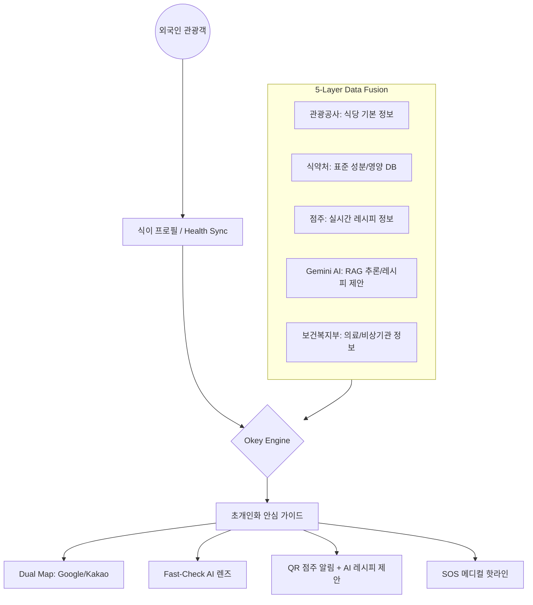

# 🚀 OkeyMeal 서비스 컨셉 정의서

## 1. 서비스 정의 (Service Definition)
**OkeyMeal(오키밀)**은 외국인 관광객이 겪는 한국 식문화의 '불투명성'과 '언어 장벽'을 기술로 해결하는 **AI 기반 초개인화 안심 미식 케어 플랫폼**입니다. 단순한 식당 추천을 넘어, 비상 상황 대응(SOS)과 AI 기반 조리 대안 제시를 통해 안전한 미식 경험을 엔드투엔드(End-to-End)로 보장합니다.

## 2. 슬로건 (Slogan)
> **"Okey! 오키밀이 확인했으니 안심하고 드세요!"**
> *(Safe K-Gourmet for Everyone)*

## 3. 핵심 가치 제안 (Key Value Propositions)

### ① 신뢰(Trust) & 안전(Safety): 5-Layer Data Fusion
주관적인 리뷰에 의존하지 않고, 관광공사, 식약처, 점주 레시피, Gemini AI, 그리고 **의료기관 데이터**까지 결합한 5중 검증 시스템을 통해 생명과 직결된 안전 정보를 제공합니다.

### ② 상생(Win-Win) & 지능(Intelligence): Zero-Barrier Bridge
단순한 경고를 넘어 점주에게 **AI 대체 레시피**를 제안함으로써, 외국인 응대에 대한 두려움을 없애고 실제 매출로 연결하는 중재자 역할을 수행합니다.

### ③ 경험(Experience): Hyper-Personalized Discovery
글로벌 헬스 데이터(Apple/Google) 연동을 통해 사용자의 상태를 즉시 파악하고, 최적의 안심 식당을 실시간으로 큐레이션합니다.

---

## 4. 서비스 아키텍처 컨셉 (Conceptual Architecture)

---

## 5. 타겟 시장 및 지역 전략 (Target Market & Area)

### 📍 거점 지역: 제주 특별자치도 (Jeju Island)
- **선정 이유:** 대한민국 최고의 인바운드 관광지이며, 메밀, 흑돼지, 해산물 액젓 등 식이 제약 확인이 필수적인 향토 음식이 밀집된 지역입니다.
- **특화 전략:** 제주 스마트 관광 인프라와 연계하여 '제주 안심 미식 루트'를 우선 구축합니다.

---

## 6. 서비스 미션 및 비전 (Mission & Vision)

### 🎯 미션 (Mission)
"식탁 위의 모든 장벽과 공포를 허물어, 전 세계 누구나 한국의 맛을 안심하고 즐기게 한다."

### 🔭 비전 (Vision)
"글로벌 관광객이 한국 여행 시 가장 먼저 켜는 '글로벌 식품/의료 안전 데이터 표준' 플랫폼으로 성장."

---

## 📝 변경 이력
| 버전 | 날짜 | 변경 내용 | 작성자 |
|---|---|---|---|
| v1.0.0 | 2026-04-20 | 초기 서비스 컨셉 정의서 작성 | 숭늉 |
| v1.1.0 | 2026-04-22 | 의료 데이터 레이어(L5) 및 SOS/AI 제안 컨셉 통합 | 숭늉 |
