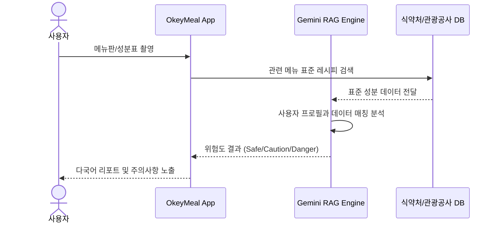

# 📄 [제안서] OkeyMeal (오키밀)
**- 외국인 관광객의 식이 안전 및 보편적 관광권 보장을 위한 AI 기반 안심 케어 서비스 -**

---

## 1) 서비스 기획배경 및 필요성

### 1. 서비스 기획 배경
*   **방한 관광객의 급증과 식이 다양성 대응 미흡:** K-푸드 열풍으로 방한 관광객은 늘고 있으나, 비건(전 세계 약 7,900만 명, Statista 2023), 할랄(전 세계 무슬림 약 18억 명, 전체 인구의 약 25%, Pew Research Center), 특정 식품 알레르기 보유자들에 대한 국내 수용 태세는 여전히 '메뉴 이름 번역' 수준에 머물러 있습니다.
*   **데이터 파편화로 인한 '음식 공포(Food Phobia)':** 관광 정보(관광공사)와 식품 성분 정보(식약처)가 분절되어 있어, 외국인 관광객은 육수나 양념에 숨겨진 성분을 확인하지 못한 채 불안한 식사를 이어가고 있습니다. (한국관광공사 「외래관광객 실태조사」 기준, 음식은 외국인 관광객 만족도 1위인 동시에 언어 장벽으로 인한 불편 1위 항목임)

### 2. 서비스 필요성 (공익적 가치)
*   **생존형 관광 안전 인프라:** 단순한 편의를 넘어, 치명적인 알레르기 사고를 예방하고 비상시 의료기관을 즉시 연결하는 **국가적 차원의 디지털 안전망**이 필요합니다.
*   **포용적 관광(Inclusive Tourism) 실현:** 신체적·종교적·신념적 이유로 식이에 제약이 있는 소수자들도 차별 없이 한국의 미식을 즐길 수 있는 **'보편적 관광권'**을 보장해야 합니다.
*   **소상공인 디지털 격차 해소 및 상생:** 영어 응대가 불가능한 영세 소상공인들에게 AI 기술을 지원하여, 외국인 고객 거부감을 없애고 실질적인 지역 경제 활성화를 도모합니다.

---

## 2) 서비스 개요

### 1. 기획 서비스 소개
> **"누구나 안심하고 한국을 맛볼 수 있도록 기술로 답하는 안심 미식 가이드, OkeyMeal"**

#### ■ 브랜드 네이밍 의미 (Brand Identity)
*   **Okey (Okay):** 사용자의 식이 제약에 대해 AI와 점주가 내리는 **"안심해도 좋다"**는 확정적 답변이자 긍정의 신호.
*   **Meal:** 단순한 영양 섭취를 넘어, 언어 장벽과 공포 없이 즐기는 **행복한 식사 경험**.
*   **Core Value:** "Is it okay for me?"라는 질문에 데이터로 답하는 **'안심 미식 안전망'**.

### 2. 기획 서비스 주요 기능

#### ① 초개인화 프로필 & 보편적 접근성
*   **기능:** 22종 알레르기, 비건 단계, 종교적 제한 사항 설정.
*   **기술:** 직관적인 온보딩 UI를 통한 식이 프로필 설정 지원. Apple Health(iOS) / Google Fit(Android) 연동을 통한 자동 건강 데이터 온보딩은 Phase 5 확장 기능으로 예정.
*   **공익성:** 비회원 게스트 모드를 지원하여 가입 장벽 없이 누구나 즉시 안전 정보를 제공받도록 설계.

#### ② Fast-Check AI 렌즈 (RAG 기반 추론)
*   **기능:** 메뉴판 촬영 시 실시간 다국어 해설 및 위험 성분 직관적 노출 (신호등 시스템).
*   **기술:** Cloud Vision OCR + Gemini Pro 기반 RAG(Retrieval-Augmented Generation). 식약처 표준 레시피 DB를 대조하여 할루시네이션(환각 현상) 최소화.

#### ③ QR 기반 점주 알림, 상생 레시피 제안 및 AI 질문 생성
*   **기능:** 점주에게 사용자의 식이 제약 정보를 한국어로 즉시 전달하고, 조리 가능한 대안 메뉴를 AI가 제안. 아울러 사용자 프로필 기반으로 점주에게 물어볼 구체적인 한국어 질문(예: "육수에 새우가 들어가나요?")을 자동 생성하여 언어 장벽 없는 직접 소통 지원.
*   **공익성:** 소상공인에게 별도의 앱 설치나 유료 비용 없이 웹 브라우저 기반으로 AI 지원 도구를 무료 보급.

#### ④ SOS 메디컬 핫라인
*   **기능:** 알레르기 반응 등 비상 상황 발생 시, 현 위치 기반 외국어 대응 가능 응급실/약국 매핑.
*   **기술:** 보건복지부 의료기관 API 연동 및 실시간 길 안내.

#### ⑤ 안심 식당 지도 탐색 (하이브리드 지도 전략)
*   **기능:** 내 식이 프로필 기반으로 주변 식당의 안전도를 지도 위에 신호등 핀(Safe/Caution/Danger)으로 즉시 표시. "내 주변 500m 이내 땅콩 프리 식당" 등 조건별 스마트 필터 검색 지원.
*   **기술: 하이브리드 안심 맵 엔진.** 외국인에게 익숙한 **Google Maps UI**와 국내 정밀 POI(**Kakao/Tour API**) 데이터를 결합. 별도 앱 설치 없이 브라우저 환경에서 정밀 위치 및 안심 식당 정보를 제공하여 접근성 극대화.
*   **공익성:** 추가 앱 설치나 가입 없이 지도 하나로 안전한 식당을 직관적으로 탐색할 수 있는 **'제로 베리어(Zero Barrier)'** 설계.

---

## 3) 기술적 차별성 및 구현 전략

### 1. 5-Layer Data Fusion 아키텍처
단일 데이터의 불확실성을 극복하기 위해 5단계 데이터 융합 엔진을 구축합니다.

| 레이어 | 데이터 소스 | 역할 |
|---|---|---|
| **Layer 1** | 한국관광공사 Tour API | 전국 식당 기본 정보 및 다국어 메타데이터 제공 (필수 기반 데이터) |
| **Layer 2** | 식약처 레시피 DB | 표준 조리법 기반 성분 추론의 기준점 (Ground Truth) |
| **Layer 3** | 점주 직접 입력 데이터 | 실제 매장별 특이 사항 및 교차 오염 주의 정보 (최신 데이터 보강) |
| **Layer 4** | Gemini AI 추론 | 문맥 기반 위험도 분석 및 맞춤형 커뮤니케이션 생성 (Intelligence) |
| **Layer 5** | 보건복지부 의료 API | 사후 대응을 위한 의료 인프라 연결 (Safety Net) |

### 2. AI 분석 프로세스 (Sequence)

---

## 4) OpenAPI 데이터 활용 및 공공 기여 방안

### 1. 활용 예정 OpenAPI
*   **한국관광공사 (Tour API 4.0):** 전국 식당 POI(Point of Interest) 데이터, 다국어 관광 정보, 무장애 여행 정보, 관광빅데이터(DataLab).
*   **식품의약품안전처:** 조리식품 레시피 DB(COOKRCP01), 식품영양성분 DB(I2791).
*   **보건복지부/심평원:** 전국 병의원·약국 현황 API (외국어 진료 가능 기관 필터링).

### 2. 데이터 선순환 및 공공 기여
*   **민관학 데이터 거버넌스:** 서비스 운영을 통해 수집된 '외국인 선호 식이 트렌드' 및 '지역별 안심 식당 데이터'를 관광공사에 재공유하여 향후 국가 관광 정책 수립의 기초 자료로 제공.
*   **지방 관광 활성화:** 제주의 성공 모델을 기반으로 지방 소도시의 특화 음식(지역 축제 등) 성분 데이터를 구축하여 지역 관광 소멸 문제 해결에 기여.

---

## 5) 비즈니스 모델 및 지속 가능성 (공익 중심)

### 1. 지속 가능한 운영 구조
*   **B2G 협업 모델:** 지자체(제주도 등)의 '안심 관광 사업'과 연계하여 공식 인증 마크 및 오프라인 QR 키트 보급 사업 추진.
*   **사회적 기여 모델:** 'K-Food 안심 식당' 인증제를 운영하여 참여 식당의 글로벌 인지도를 높여주는 상생 구조 구축.

### 2. 기대 효과
*   **사회적:** 식이 소외 계층의 안전 보장 및 한국 관광의 '안전·포용' 이미지 전 세계 확산.
*   **경제적:** 소상공인 매출 보호 및 외국인 관광객의 재방문율 향상을 통한 관광 수익 극대화.

### 3. 핵심 성과 지표 (KPI, 제주 파일럿 기준)

| 지표 | 목표치 | 측정 방법 |
|---|---|---|
| **파일럿 참여 식당 수** | 제주 지역 10개소 이상 | 점주 관리자 계정 생성 수 (Phase 4 종료 시) |
| **점주 QR 키트 온보딩 완료율** | 참여 식당 중 80% 이상 | 안심 QR 코드 생성 이벤트 로그 |
| **성분 분석 AI 정확도** | 자체 검증 세트 기준 90% 이상 | 식약처 DB 정답 레이블 50건 대비 AI 응답 일치율 |
| **QR 알림 응답 속도** | 점주 수신까지 평균 3초 이내 | 서버 이벤트 타임스탬프 로그 |
| **사용자 경험 만족도** | 4.0 / 5.0점 이상 | 외국인 현장 인터뷰 30건 이상 (국적 3개국 이상) |

---

## 📝 변경 이력
| 버전 | 날짜 | 변경 내용 | 작성자 |
|---|---|---|---|
| v1.3.0 | 2026-04-24 | 공익성 및 관광 복지 중심 고도화, 네이밍 의미 보완, 공공 기여 방안 추가 | 숭늉 |
| v1.3.1 | 2026-04-24 | 무결성 원칙에 따른 기술 사양(5-Layer 표, 다이어그램) 및 OpenAPI 상세 목록 복구 및 병합 | 숭늉 |
| v1.4.0 | 2026-04-24 | Health Sync 표현 조정(Phase 5 예정으로 명시), 통계 수치 출처 보완, AI 질문 생성기 추가, ⑤ 안심 식당 지도 탐색 섹션 신설, KPI 표 추가 | 숭늉 |
| v1.5.0 | 2026-04-27 | 하이브리드 안심 맵 엔진 전략 반영 (별도 앱 설치 없는 Google Maps UI + 국내 정밀 데이터 결합) | 숭늉 |
| v1.5.1 | 2026-05-06 | 제안서 최종 제출본 확정 및 날짜 갱신 | 숭늉 |
