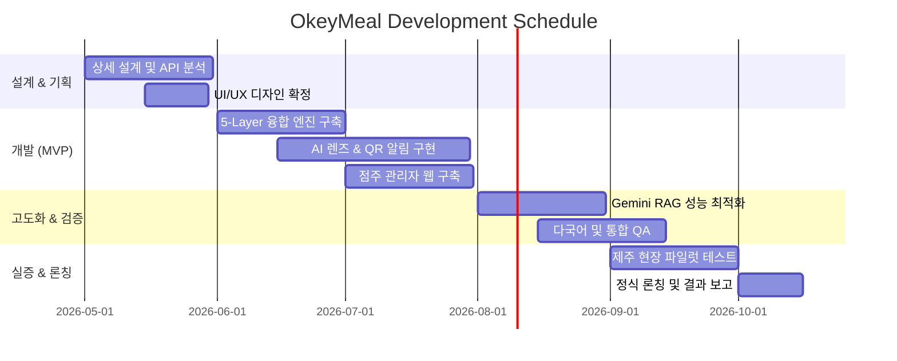

# 📅 프로젝트 추진 일정 (Schedule Plan)

OkeyMeal의 성공적인 론칭을 위한 단계별 마일스톤과 추진 일정입니다. (총 6개월 기준)

---

## 1. 단계별 핵심 로드맵

| 단계 (Phase) | 핵심 활동 | 기간 | 주요 산출물 |
|---|---|---|---|
| **Phase 1: 설계 및 준비** | 서비스 상세 설계, 데이터 API 연동 테스트, UI/UX 디자인 | 1개월 | 상세 설계서, 와이어프레임 |
| **Phase 2: MVP 개발** | 5-Layer 데이터 융합 엔진 개발, AI 렌즈 및 QR 알림 핵심 기능 구현 | 2개월 | 프로토타입 앱, 백엔드 API |
| **Phase 3: 고도화 및 테스트** | RAG 모델 튜닝, 다국어 확장, 사용자 QA 및 버그 수정 | 1.5개월 | Beta 버전 앱, QA 결과서 |
| **Phase 4: 지역 특화 실증** | 제주 지역 안심 식당 QR 배포 및 현장 점주 테스트 | 1개월 | 현장 피드백 리포트 |
| **Phase 5: 론칭 및 마케팅** | 정식 론칭, 공모전 발표, SNS 글로벌 홍보 캠페인 | 0.5개월 | 최종 앱, 마케팅 성과서 |

---

## 2. 상세 추진 일정표 (Gantt Chart 형식)

---

## 3. 담당자 및 리소스 계획
*   **프로젝트 관리 및 기획:** 숭늉 (총괄)
*   **개발 (Front/Back/AI):** 숭늉 & 바이브 코딩 에이전트
*   **데이터 리서치:** 공공데이터 포털 및 주최사 협력
*   **디자인:** Tailwind CSS & AI 생성 UI 디자인

---

## 📝 변경 이력
| 버전 | 날짜 | 변경 내용 | 작성자 |
|---|---|---|---|
| v1.0.0 | 2026-04-20 | 프로젝트 추진 일정 계획서 작성 | 숭늉 |
| v1.0.1 | 2026-04-24 | Phase 2 데이터 융합 엔진 명칭을 "4-Layer"에서 "5-Layer"로 통일 | 숭늉 |
| v1.1.0 | 2026-05-06 | 제안서 최종 제출본 반영 및 날짜 갱신 | 숭늉 |
