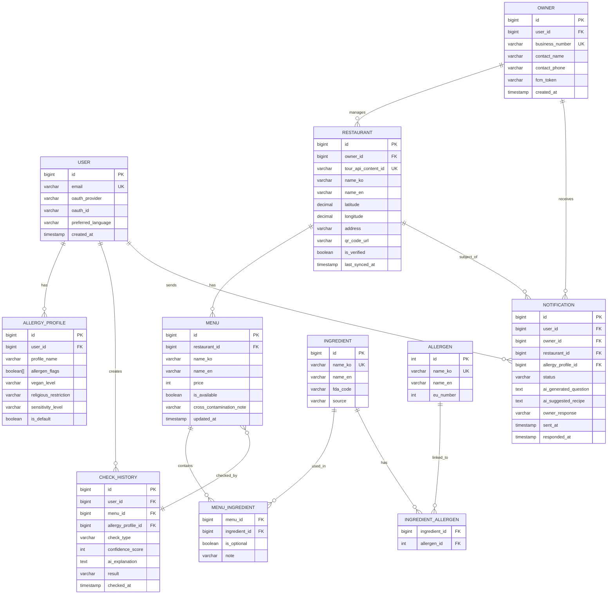

# 🗄️ OkeyMeal 데이터베이스 스키마 설계서

> 참조 문서: `04.Design/System_Architecture.md`, `02.Planning/Core_Features.md`
> DBMS: PostgreSQL 16.x

---

## 1. ERD (Entity Relationship Diagram)



---

## 2. 테이블 상세 정의

### 2.1 USER (사용자)

| 컬럼명 | 타입 | PK/FK | Nullable | 설명 |
|---|---|---|---|---|
| `id` | BIGSERIAL | PK | NO | 자동 증가 기본키 |
| `email` | VARCHAR(255) | UK | YES | OAuth 제공 이메일 (비회원은 NULL) |
| `oauth_provider` | VARCHAR(20) | - | YES | 'google', 'kakao', 'apple' |
| `oauth_id` | VARCHAR(255) | - | YES | OAuth 고유 식별자 |
| `preferred_language` | VARCHAR(10) | - | NO | 'ko', 'en', 'ja', 'zh' (기본: 'en') |
| `created_at` | TIMESTAMP | - | NO | 계정 생성 시각 |

### 2.2 ALLERGY_PROFILE (식이 프로필)

| 컬럼명 | 타입 | PK/FK | Nullable | 설명 |
|---|---|---|---|---|
| `id` | BIGSERIAL | PK | NO | |
| `user_id` | BIGINT | FK(USER) | NO | |
| `profile_name` | VARCHAR(50) | - | NO | 예: "내 기본 프로필", "아이용" |
| `allergen_flags` | BOOLEAN[] | - | NO | 22가지 알레르기 유발 물질 T/F 배열 |
| `vegan_level` | VARCHAR(20) | - | YES | 'none', 'flexitarian', 'vegetarian', 'vegan', 'raw_vegan' |
| `religious_restriction` | VARCHAR(20) | - | YES | 'none', 'halal', 'kosher', 'hindu_veg' |
| `sensitivity_level` | VARCHAR(20) | - | NO | 'strict' (교차오염 포함), 'moderate' (직접 성분만) |
| `is_default` | BOOLEAN | - | NO | 기본 프로필 여부 |

### 2.3 RESTAURANT (식당)

| 컬럼명 | 타입 | PK/FK | Nullable | 설명 |
|---|---|---|---|---|
| `id` | BIGSERIAL | PK | NO | |
| `owner_id` | BIGINT | FK(OWNER) | YES | NULL이면 관광공사 데이터만 있는 미등록 식당 |
| `tour_api_content_id` | VARCHAR(50) | UK | YES | 관광공사 Tour API contentId |
| `name_ko` | VARCHAR(100) | - | NO | 한국어 식당명 |
| `name_en` | VARCHAR(100) | - | YES | 영문명 |
| `name_ja` | VARCHAR(100) | - | YES | 일문명 |
| `name_zh` | VARCHAR(100) | - | YES | 중문명 |
| `latitude` | DECIMAL(10,7) | - | NO | 위도 |
| `longitude` | DECIMAL(10,7) | - | NO | 경도 |
| `address` | VARCHAR(255) | - | YES | 주소 |
| `phone` | VARCHAR(20) | - | YES | 연락처 |
| `category` | VARCHAR(50) | - | YES | 음식 카테고리 |
| `qr_code_url` | VARCHAR(500) | - | YES | 생성된 QR 이미지 URL |
| `is_verified` | BOOLEAN | - | NO | 점주가 직접 등록·관리하는 인증 식당 여부 (기본: false) |
| `last_synced_at` | TIMESTAMP | - | YES | 관광공사 API 마지막 동기화 시각 |

### 2.4 MENU (메뉴)

| 컬럼명 | 타입 | PK/FK | Nullable | 설명 |
|---|---|---|---|---|
| `id` | BIGSERIAL | PK | NO | |
| `restaurant_id` | BIGINT | FK(RESTAURANT) | NO | |
| `name_ko` | VARCHAR(100) | - | NO | 한국어 메뉴명 |
| `name_en` | VARCHAR(100) | - | YES | 영문 메뉴명 |
| `description_ko` | TEXT | - | YES | 메뉴 설명 |
| `image_url` | VARCHAR(500) | - | YES | 메뉴 이미지 URL |
| `price` | INT | - | YES | 가격 (원) |
| `is_available` | BOOLEAN | - | NO | 현재 판매 여부 (기본: true) |
| `cross_contamination_note` | TEXT | - | YES | 교차 오염 주의사항 (점주 직접 입력) |
| `updated_at` | TIMESTAMP | - | NO | 레시피/정보 최종 수정 시각 — 변경 알림 기준 |

### 2.5 CHECK_HISTORY (안심 확인 이력)

| 컬럼명 | 타입 | PK/FK | Nullable | 설명 |
|---|---|---|---|---|
| `id` | BIGSERIAL | PK | NO | |
| `user_id` | BIGINT | FK(USER) | YES | 비회원은 NULL |
| `menu_id` | BIGINT | FK(MENU) | YES | AI 렌즈는 메뉴 특정 불가하면 NULL |
| `allergy_profile_id` | BIGINT | FK(ALLERGY_PROFILE) | YES | |
| `check_type` | VARCHAR(20) | - | NO | 'lens', 'menu_detail', 'qr_scan' |
| `confidence_score` | INT | - | NO | 0~100 (RAG 신뢰도) |
| `ai_explanation` | TEXT | - | YES | 다국어 AI 해설 (JSON 직렬화) |
| `result` | VARCHAR(10) | - | NO | 'safe', 'caution', 'danger', 'unknown' |
| `checked_at` | TIMESTAMP | - | NO | |

### 2.6 NOTIFICATION (점주 알림)

| 컬럼명 | 타입 | PK/FK | Nullable | 설명 |
|---|---|---|---|---|
| `id` | BIGSERIAL | PK | NO | |
| `user_id` | BIGINT | FK(USER) | NO | 알림을 보낸 사용자 |
| `owner_id` | BIGINT | FK(OWNER) | NO | 수신 점주 |
| `allergy_profile_id` | BIGINT | FK(ALLERGY_PROFILE) | NO | 전달된 식이 프로필 |
| `status` | VARCHAR(20) | - | NO | 'pending', 'sent', 'responded', 'expired' |
| `ai_generated_question` | TEXT | - | YES | AI가 생성한 한국어 질문 |
| `ai_suggested_recipe` | TEXT | - | YES | AI 대체 레시피 제안 |
| `owner_response` | VARCHAR(20) | - | YES | 'safe', 'unsafe', 'alternative', 'no_response' |
| `sent_at` | TIMESTAMP | - | NO | |
| `responded_at` | TIMESTAMP | - | YES | |

---

## 3. 인덱스 전략

```sql
-- 지도 검색 성능 (위경도 기반 범위 검색)
CREATE INDEX idx_restaurant_location ON restaurant USING GIST (
    ST_MakePoint(longitude, latitude)
);

-- 사용자별 확인 이력 조회
CREATE INDEX idx_check_history_user ON check_history (user_id, checked_at DESC);

-- 점주 알림 상태 조회
CREATE INDEX idx_notification_owner_status ON notification (owner_id, status, sent_at DESC);

-- 식당 Tour API 동기화
CREATE INDEX idx_restaurant_sync ON restaurant (last_synced_at) WHERE is_verified = false;
```

---

## 4. 데이터 시딩 전략 (Cold Start 해결)

초기 데이터 부족 문제 해결을 위한 사전 적재 계획:

| 데이터 소스 | 적재 대상 | 방식 | 시점 |
|---|---|---|---|
| 관광공사 Tour API | `restaurant` 테이블 (기본 정보) | 배치 스크립트 | 개발 환경 구축 시 |
| 식약처 COOKRCP01 | `ingredient`, `allergen` 테이블 | 배치 스크립트 | 개발 환경 구축 시 |
| 식약처 I2791 | `ingredient` 영양 성분 보완 | 배치 스크립트 | 개발 환경 구축 시 |
| 보건복지부 의료기관 | 별도 `medical_facility` 테이블 (추후 설계) | 일 1회 배치 | Phase 2 |

---

## 📝 변경 이력
| 버전 | 날짜 | 변경 내용 | 작성자 |
|---|---|---|---|
| v1.0.0 | 2026-04-23 | DB 스키마 초안 작성 — ERD, 핵심 테이블 정의, 인덱스 전략, 시딩 계획 | 숭늉 |
| v1.0.1 | 2026-04-23 | ERD 관계 방향 오류 수정(OWNER→RESTAURANT), NOTIFICATION 엔티티 누락 FK 추가, MENU 테이블 컬럼 분리 및 updated_at 추가 | 숭늉 |
