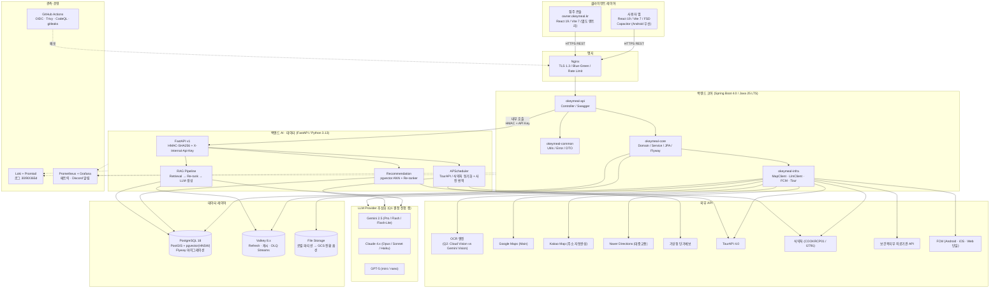
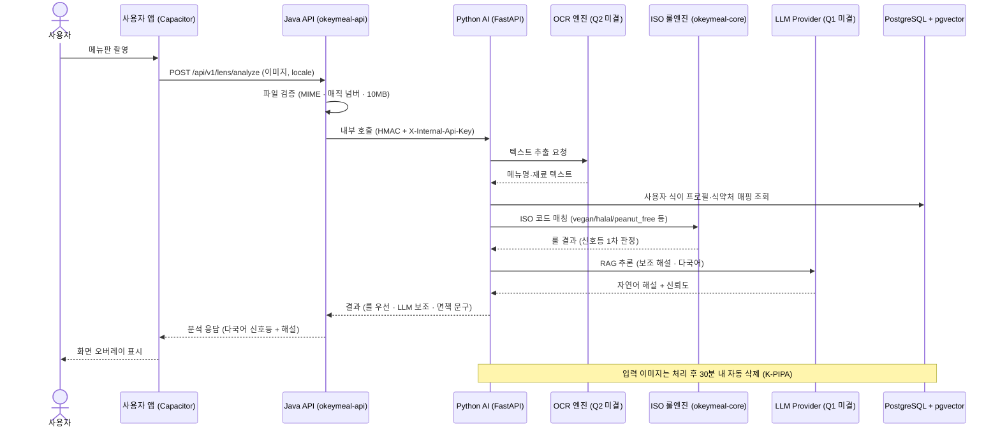
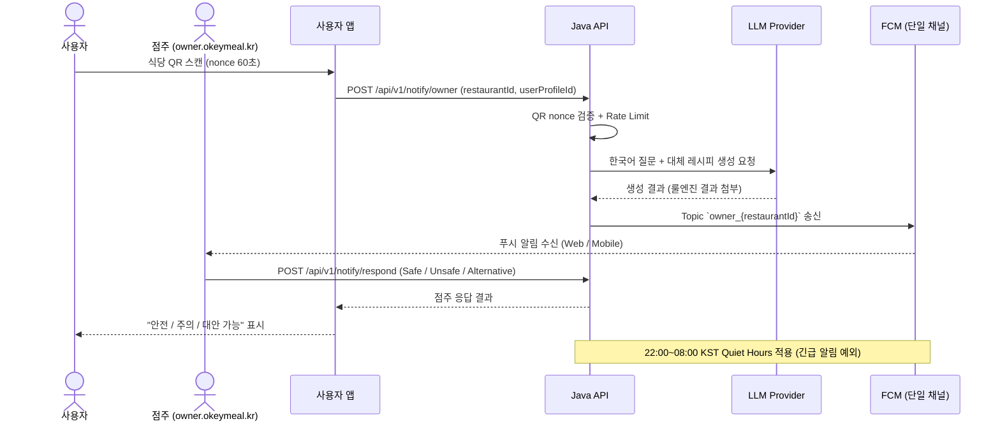

# 🏗️ OkeyMeal 시스템 아키텍처 정의서

> **단일 진실 공급원(SSOT) 관계:** 본 문서는 [`Technical_Decision_Records.md`](./Technical_Decision_Records.md) (TDR v3.1.0)의 결정을 시각화·요약합니다. 기술 결정 정본은 TDR이며, 충돌 시 TDR 우선.
>
> 참조: `01.Ideation/Requirements.md` (FR/NFR), `02.Planning/Core_Features.md` (기능 인덱스), `02.Planning/WBS.md` (구현 일정), `04.Design/External_API_Inventory.md` (외부 API 명세).

---

## 1. 전체 시스템 구성도



> **Mermaid 노드 표기:** 본 다이어그램은 모듈 경계만 시각화합니다. 모듈 내부 컴포넌트·시퀀스는 §3 데이터 흐름과 TDR §1.1·§1.5를 참조하세요.

---

## 2. 레이어별 역할 및 기술 스택

### 2.1 프론트엔드 (Client Layer)

| 구분 | 사용자 앱 (Web + Android) | 점주 콘솔 (Web 전용) |
|---|---|---|
| **도메인** | `okeymeal.kr` / `app.okeymeal.kr` | **`owner.okeymeal.kr`** (별도 서브도메인) |
| **프레임워크** | React 19 + Vite 7 | React 19 + Vite 7 (`apps/owner/` 별도 엔트리) |
| **런타임** | Node.js 24 (Active LTS) | Node.js 24 (Active LTS) |
| **아키텍처** | FSD (Feature-Sliced Design) | FSD (공통 컴포넌트 90%+ 재사용) |
| **상태 관리** | Zustand | Zustand |
| **다국어** | i18next + react-i18next (ko/en/ja/zh-CN) | i18next (운영자 대상 ko 위주) |
| **하이브리드** | **Capacitor (Android 정식 등록, iOS Phase 2)** | 미적용 (반응형 웹) |
| **지도 SDK** | Google Maps JS SDK (메인) + Kakao(주소) + Naver(대중교통) | 미사용 |
| **주요 화면** | 온보딩·식이 프로필, 지도 탐색, AI 렌즈, QR 스캔, 추천, 리뷰, SOS | 식당·메뉴 관리, 리뷰 응대, QR 발급, 푸시 수신함 |

### 2.2 백엔드 (Hybrid: Java 코어 + Python AI)

#### ■ Java 코어 — Spring Boot 4.0 / Java 25 LTS

| 항목 | 내용 |
|---|---|
| **프레임워크** | Spring Boot 4.0.x (Jakarta EE 11, Java 25 LTS) |
| **빌드 툴** | Gradle 멀티 모듈 |
| **모듈** | `okeymeal-api` (Controller·Security·Swagger), `okeymeal-core` (Domain·Service·JPA·Flyway), `okeymeal-infra` (외부 어댑터), `okeymeal-common` (Util·Error·DTO) |
| **API 스타일** | RESTful JSON, 공통 에러 응답 포맷(`code`/`message`/`message_en`/`traceId`) |
| **인증** | JWT — Access 30분 / Refresh 30일 회전, Guest JWT 90일, 점주 Refresh 7일. 소셜 4종(Google·Apple·Kakao·Naver) |
| **DB 접근** | JPA + Flyway (`okeymeal-core`가 단독 관리 주체) |
| **안정성** | Resilience4j (Timeout / Retry / Circuit Breaker / Bulkhead / Fallback / DLQ) — §6 참조 |

#### ■ Python AI·데이터 — FastAPI / Python 3.13

| 항목 | 내용 |
|---|---|
| **프레임워크** | FastAPI (Pydantic v2, SQLAlchemy 2.0+) |
| **역할** | AI 추천(임베딩·재정렬·RAG), 외부 Open API 수집·전처리, 다국어 사전 번역 배치 |
| **스케줄러** | APScheduler (배치 잡), 대용량 적재는 Spring Batch에 위임 |
| **Java↔Python 통신** | REST (JSON) + Docker 내부망(`okeymeal-internal`) + `X-Internal-Api-Key` + HMAC-SHA256 서명. mTLS는 VM 분리·외부 협력사 연동 시점 전환 |
| **DB 권한** | Java(`okeymeal-core`)와 동일 PostgreSQL 인스턴스 읽기·쓰기, **Flyway 마이그레이션 권한 없음**(SQLAlchemy 리플렉션) |

### 2.3 데이터 레이어

| 항목 | 내용 |
|---|---|
| **메인 DB** | **PostgreSQL 18.x** + PostGIS 3.5+ + pgvector 0.8+ (HNSW 인덱스로 ANN 가속) |
| **임베딩** | `vector(768)` 컬럼 — User / Restaurant / Menu 3종. Gemini `text-embedding-004` 1차 후보, 코사인 유사도 (`<=>`) |
| **JSONB 다국어** | 식당·메뉴·태그 4개국(ko/en/ja/zh-CN) 사전 번역, GIN 인덱스(`jsonb_path_ops`) |
| **마이그레이션** | Flyway — `V{YYYYMMDD}{NN}__*.sql`, `flyway.outOfOrder=false`, Expand-Contract 패턴 강제 |
| **캐시·세션** | **Valkey 8.x** (Redis 7.2 fork, BSD-3 라이선스) — `auth:refresh:{userId}`, `cache:reco:{userId}:v{ver}:{ctx}`, `cache:llm:{model}:{hash}`, `i18n:review:{id}:{locale}`, `stream:llm:dlq`, `stream:ingest:dlq` |
| **파일 저장소** | 1단계: 서버 파티션 `/data/okeymeal/uploads` (Docker 볼륨). 2단계: GCS/S3 전환 (`StorageClient` 추상화) |
| **백업·DR** | `pg_basebackup` 일일 + WAL 아카이빙(`archive_timeout=60s`) → **RPO 1분 / RTO 30분**. GCS Coldline 30일 보관, 분기 1회 복구 리허설 |

### 2.4 AI / 외부 서비스 연동

| 서비스 | 용도 | 비고 |
|---|---|---|
| **LLM Provider 추상화** | W1 추천 설명문 · W2 사전 번역(Batch) · W3 AI 렌즈 · W4 리뷰 요약 | **Q1 미결** — Gemini/Claude/GPT 워크로드별 매핑 PoC 후 확정 (TDR §1.5) |
| **OCR 엔진** | 메뉴판·성분표 텍스트 추출 | **Q2 미결** — Google Cloud Vision vs Gemini Vision 단독 (TDR Q2) |
| **Google Maps** | 메인 지도·POI·다국어 라벨 | JS SDK (프론트) + Server Key 분리, Referer 화이트리스트 |
| **Kakao Map** | 국내 주소 검색·자동완성 (Geocoding) | 백엔드 REST |
| **Naver Directions API** | 대중교통 길찾기 (지하철·버스) | 백엔드 REST |
| **기상청 단기예보** | 추천 재정렬 가중치(추운 날·더운 날·우천) | 30분 캐시 |
| **TourAPI 4.0** | 식당 기본 정보·다국어 소개 | 일 1회 배치 + 변경분 동기화 |
| **식약처 (COOKRCP01 / I2791)** | 표준 레시피·영양성분 DB | 야간 배치 |
| **보건복지부** | 외국어 진료 가능 의료기관 (SOS) | 일 1회 배치 |
| **FCM Cloud Messaging v1** | **단일 채널**로 Android · iOS · Web 푸시 송출 (Topic + Token 모델) | 점주 알림 + 사용자 추천·이벤트 알림 |

> 외부 API 상세 한도·Key 관리는 [`External_API_Inventory.md`](./External_API_Inventory.md) 참조.

---

## 3. 데이터 흐름 (Request Flow)

### 3.1 AI 렌즈 (메뉴판 OCR) 흐름



> **신뢰도 우선순위:** 알레르기 판정은 **ISO 코드 룰엔진 결과를 우선** 표시하며, LLM 생성문은 보조 해설입니다. Hallucination 방지를 위해 응답 후 식당명·메뉴명 원본 대조 검증을 수행합니다 (TDR §1.5 RAG).

### 3.2 QR 점주 알림 흐름 (FCM)



### 3.3 추천 RAG 흐름 (요약)

1. **Retrieval** — `okeymeal-api` → Python `RECO`로 위임 → pgvector ANN(`<=>`)으로 Top-K=50 검색.
2. **Re-rank** — 거리·시간대·날씨(기상청)·운영 상태·개인 이력 가중치 곱해 Top-3 선별.
3. **Augmentation** — Top-3 식당 정보 + 사용자 식이 프로필을 프롬프트 컨텍스트로 주입.
4. **Generation** — LLM(W1, 1차 Gemini Flash 후보)이 사용자 locale로 추천 설명문 생성.
5. **Cache** — `cache:reco:{userId}:v{profileVersion}:{locale}` Valkey 6시간 + 프로필 변경 이벤트 무효화.

---

## 4. 환경 구성 (Infrastructure)

### 4.1 환경 분리 (1단계: 논리 / 2단계: 물리)

| 환경 | 도메인 | 분리 방식 | 시크릿 출처 |
|---|---|---|---|
| **dev (local)** | localhost | Docker Compose | `.env.dev` (git-crypt) |
| **staging** | `stg.okeymeal.kr` | 동일 VM 내 별도 Docker network + 포트 8090 + DB schema 분리 | GitHub Actions Secrets |
| **prod** | `okeymeal.kr`, `owner.okeymeal.kr` | 동일 VM Blue/Green 슬롯, Nginx 트래픽 스왑 | GitHub Actions Secrets |

* **2단계 전환 트리거:** 동시 사용자 1k 도달 · 외부 협력사 연동 · 결제/의료 정보 처리 시작.
* **데이터 격리:** prod → staging 직접 복제 금지. 마스킹 스크립트 거친 합성 데이터만 사용.

### 4.2 단일 VM 사양

| 구분 | 사양 | 비고 |
|---|---|---|
| **OS** | Ubuntu 24.04 LTS | `root` 차단 / `deploy` 계정 / SSH Key 강제 / UFW 22·80·443만 / fail2ban |
| **최소 사양** | 4 vCPU / 16 GB RAM / 200 GB SSD | PostgreSQL + Valkey + Java + Python + Loki + Prometheus + Nginx 최소 동시 가동 |
| **권장 사양** | 8 vCPU / 32 GB RAM / 500 GB SSD | 시연 트래픽 + 부하 테스트 여유 |
| **클라우드 후보** | GCP `e2-standard-8` / AWS `m6i.xlarge` / NCP `g2-server-h64s` | **Q4 미결** — 비용 검토 후 Phase 2 후반 결정 |
| **확장 트리거** | CPU 70% 5분 / 메모리 80% / 디스크 80% | 수직 확장 우선 |

### 4.3 무중단 배포 (Blue-Green)

1. 신규 컨테이너를 별도 포트로 기동(Green) → Health Check(`/actuator/health`, `/health`) 통과 대기.
2. Nginx `upstream`을 Green으로 갱신 후 `nginx -s reload`.
3. 5분 관찰 후 Blue 제거. **롤백:** upstream 되돌리고 reload (1분 내 복구).
4. **DB 마이그레이션:** Expand-Contract 패턴 강제, 단일 마이그레이션 30분 초과 시 자동 중단(`statement_timeout=1800s`), prod 직전 `pg_basebackup` 스냅샷 자동 생성.

### 4.4 CI/CD (GitHub Actions)

| 항목 | 정책 |
|---|---|
| **트리거** | PR: lint+test / `main` push: staging 배포 / `release/v*` 태그: prod 배포 |
| **매트릭스** | Java 25 / Node.js 24 / Python 3.13 단일 LTS 라인 |
| **병렬화** | `backend-java` · `backend-python` · `frontend` 잡 분리, `paths-filter` 조건부 실행 |
| **시크릿** | GitHub Actions Secrets + **OIDC**(GCP·AWS) — 장기 키 비저장 |
| **보안 스캔** | **Trivy**(이미지) · **CodeQL**(코드) · **gitleaks**(시크릿 누출) — 위반 시 PR 차단 |
| **승인 게이트** | prod 배포는 GitHub Environments Reviewer 1인 승인 필수 (Free private 환경 4단계 다층 완화의 일부 — Requirements NFR-MAINT-06) |
| **릴리스 노트** | `release-please` Conventional Commits 기반 자동 생성 |

### 4.5 모노레포 구조 (TDR §4.7)

```text
okeymeal/ (repo root)
├── .github/workflows/    # CI/CD
├── documents/            # 기획·설계 문서 (본 문서 포함)
├── runbooks/             # Flyway·배포·보안 사고 절차
├── backend-java/         # Gradle 멀티모듈
│   ├── okeymeal-api · okeymeal-core · okeymeal-infra · okeymeal-common
├── backend-python/       # FastAPI (app/api · services · models · db · scripts)
├── frontend/             # React + Vite (FSD)
│   ├── src/ · android/ · ios/ (Phase 2) · apps/owner/ · capacitor.config.ts
├── infra/                # docker-compose · nginx · prometheus · loki · deploy.sh
└── docker-compose.yml
```

---

## 5. 보안 및 데이터 정책

| 항목 | 정책 |
|---|---|
| **저장 암호화** | 알레르기·식이 프로필 DB 컬럼 AES-256-GCM (Spring Security Crypto) |
| **전송 암호화** | 외부 TLS 1.3 강제 (Nginx + Let's Encrypt), 내부 서비스 간 HMAC-SHA256 서명 |
| **시크릿 관리** | `git-crypt` (저장소 내) + GitHub Actions Secrets (CI) — 평문 `.env` 커밋 금지 |
| **인증·세션** | JWT Access 30분 / Refresh 30일 회전 + 재사용 탐지(탈취 시 전 세션 강제 종료) / 최대 5 디바이스 / 자동로그인 기본 ON |
| **Rate Limit (5계층)** | L1 Nginx 60req/min · L2 인증 5req/min(5회 실패 시 15분 잠금) · L3 LLM 30req/hour · L4 업로드 분당 10·일 100 · L5 WAF(2단계) |
| **업로드 검증** | MIME + 매직 넘버(Apache Tika / `python-magic`) + ClamAV + EXIF 제거 + UUID v7 재명명 |
| **AI 입력 마스킹** | LLM 호출 직전 이메일·전화번호·주소 마스킹 인터셉터 |
| **로그 마스킹** | 이메일·전화번호·주소·토큰 자동 마스킹 (Java/Python 공통 인터셉터). 감사 로그 1년 보존(WORM) |
| **AI 면책** | 분석 결과 하단에 법적 면책 문구 고정. **알레르기 판정은 ISO 룰엔진 우선 표시, LLM 생성문은 보조 해설** |
| **AI 렌즈 입력 보관** | 처리 후 30분 내 자동 삭제 (개인정보 최소 보관 원칙) |

### 5.1 K-PIPA 핵심 준수 사항

| 항목 | 정책 |
|---|---|
| **만 14세 미만** | 생년월일 입력 → 법정대리인 동의 분기, 미동의 시 가입 차단, 식별 정보 별도 분리 보관 |
| **정보주체 권리 응답** | 열람·정정·삭제·처리정지 요청 **10일 이내** 처리 (시행령 제46조), 처리 이력 1년 보관 |
| **개인정보 처리방침** | `/privacy` 상시 게시, 변경 시 **7일 사전 고지** + 푸시·이메일 통지 |
| **DPO** | 운영 시작 전 지정 및 처리방침에 연락처 명시 — **Q5 미결** |
| **국외 이전 고지** | LLM API(미국)·CDN 사용 시 이전 국가·항목·기간 명시 + 별도 동의 |
| **자동화 의사결정** | AI 추천에 대한 의의 제기 채널 `/contact/ai-decision` 제공 |
| **운영자 접근 통제** | IP 화이트리스트 + 2FA 강제, 접근 로그 1년 보관 |
| **회원 탈퇴** | 즉시 익명화 + 30일 복구 유예 → T+35일 백업본 동기 파기. 정지 사유 탈퇴는 동일 소셜 ID 재가입 차단 |

---

## 6. 안정성·회복 (Resilience)

Python 모듈 장애가 Java 전체로 전파되지 않도록 **Resilience4j** 6단계 패턴을 적용합니다.

| 패턴 | 정책 | 사유 |
|---|---|---|
| **Timeout** | Connect 1s / Read 3s (실시간 추천) · Read 30s (Batch 번역) | 워크로드별 분리, 체감 지연 방지 |
| **Retry** | 지수 백오프 200ms→400ms→800ms, 최대 3회, 5xx/`IOException`만 | 4xx 요청 오류 재시도 무의미 |
| **Circuit Breaker** | 슬라이딩 50건 중 50% 실패 시 OPEN, 30s HALF_OPEN | 폭주 방지·자동 회복 |
| **Bulkhead** | 추천 호출 50건 / 사전 번역 5건 분리 풀 | 한 워크로드 폭주가 다른 곳 영향 차단 |
| **Fallback** | OPEN 시 Valkey 캐시된 인기 메뉴 반환 + "추천 시스템 일시 점검 중" 안내 | 완전 다운보다 부분 기능 |
| **DLQ** | 비동기 작업 최종 실패 시 `stream:llm:dlq` / `stream:ingest:dlq` 적재, 30분 워커가 재처리 | 데이터 손실 방지 |

* **외부 API(Tour/식약처):** 타임아웃 Connect 2s / Read 10s, 지수 백오프 1s→2s→4s, CB 60% 실패 5분 OPEN, **Stale 데이터 제공** 시 응답에 `X-Data-Stale: true` 헤더.
* **LLM 자동 폴백:** Primary 모델 5xx/Timeout 3회 연속 → Fallback 모델 자동 전환 (W1 Gemini Flash↔Claude Haiku 등).

### 6.1 관측 (Observability)

| 영역 | 도구 | 보존 |
|---|---|---|
| **로그** | Grafana **Loki + Promtail** (LogQL) | 앱 30일 / Nginx 90일 / 감사 1년(WORM) |
| **메트릭** | **Prometheus + Grafana** | 핵심 임계치 도달 시 Discord Webhook |
| **알림 임계** | CPU 90% · 5xx 비율 1% · p95 응답 1s · LLM 토큰 예산 80% · 외부 API 연속 실패 30분 | — |
| **API 문서** | Nginx 라우팅: `/docs/java` (SpringDoc) · `/docs/python` (FastAPI 자동) | 설계 단계는 `API_Specification.md`(미작성, Phase 2) |
| **분석 지표** | GA4 + Plausible(쿠키리스) + Mixpanel 무료 | 공모전 KPI 보고용 |

---

## 7. 미결 결정 사항 (Open Questions)

본 아키텍처에 직접 영향을 주는 미결 항목입니다 (전체 목록은 `CONTEXT.md` §6 참조).

| # | 영역 | 미결 내용 | 결정 시점 |
|---|---|---|---|
| **Q1** | LLM | Gemini / Claude / GPT 워크로드별 Primary 모델 확정 (W1~W4) | Phase 2 PoC 후 |
| **Q2** | AI 렌즈 | OCR 엔진 (Google Cloud Vision vs Gemini Vision 단독) | Phase 2 |
| **Q4** | 인프라 | 단일 VM 클라우드 제공자 (GCP/AWS/NCP) + 비용 검토 | Phase 2 후반 |
| **Q5** | K-PIPA | DPO(개인정보 보호책임자) 지정 | 운영 시작 전 |

### 7.1 점진적 강화 트리거 (TDR §0 / §3.2)

| 단계 | 현재 | 전환 트리거 |
|---|---|---|
| **mTLS** | 내부 통신 HMAC + API Key | VM 분리 / 외부 협력사 연동 / 의료·결제 정보 처리 |
| **환경 분리** | 1단계 논리 분리 (동일 VM) | 동시 사용자 1k / 외부 협력사 / 결제·의료 |
| **CDN** | Nginx 정적 캐시 + Brotli | GCS 전환 시 Cloud CDN/CloudFront 결합 |
| **검색 엔진** | PostgreSQL GIN(`jsonb_path_ops`) | 식당 50만 건 초과 / 검색 p95 500ms 초과 / 오타 허용 요구 → Meilisearch 우선 |
| **Valkey 클러스터** | 단일 노드 | QPS 5k 초과 / 데이터 1GB 초과 |

---

## 📝 변경 이력
| 버전 | 날짜 | 변경 내용 | 작성자 |
|---|---|---|---|
| v1.0.0 | 2026-04-23 | 시스템 아키텍처 초안 작성 | 숭늉 |
| v1.0.1 | 2026-04-23 | 아키텍처 다이어그램 논리 오류 수정 | 숭늉 |
| v1.1.0 | 2026-05-06 | TDR v1.9.0 반영: Java 25, Spring Boot 4.0, PostgreSQL 17 업그레이드 및 보안/배포 전략 구체화 | 숭늉 |
| v2.0.0 | 2026-05-11 | **TDR v3.1.0 기준 전면 갱신**. ① §1 구성도: Java 멀티모듈(api·core·infra·common) + Python AI(FastAPI 3.13) 분리, LLM Provider 추상화(Gemini/Claude/GPT 후보), Valkey 8.x, 멀티 맵(Google Main + Kakao + Naver), FCM 단일, Loki+Prometheus, OIDC CI/CD 노드 추가. ② §2 레이어 표 전면 갱신(React 19/Vite 7, PostgreSQL 18 + pgvector HNSW 768d, 점주 콘솔 `owner.okeymeal.kr` 별도 서브도메인, 소셜 4종). ③ §3 데이터 흐름 재작성: AI 렌즈에 ISO 룰엔진 우선 + LLM 보조 + 30분 자동 삭제 명시, QR 알림에 Quiet Hours + nonce, 추천 RAG 5단계 신규. ④ §4 환경 구성 신규(논리/물리 2단계, Single VM 4·8 vCPU, Blue-Green, CI/CD 8항, 모노레포 구조). ⑤ §5 보안 K-PIPA 8항 신규(14세 미만·10일 SLA·DPO·국외 이전·자동화 의사결정 등). ⑥ §6 Resilience4j 6패턴 + 관측 신규. ⑦ §7 미결 결정(Q1·Q2·Q4·Q5) + 점진적 강화 트리거 5종 신규. | 숭늉 |
