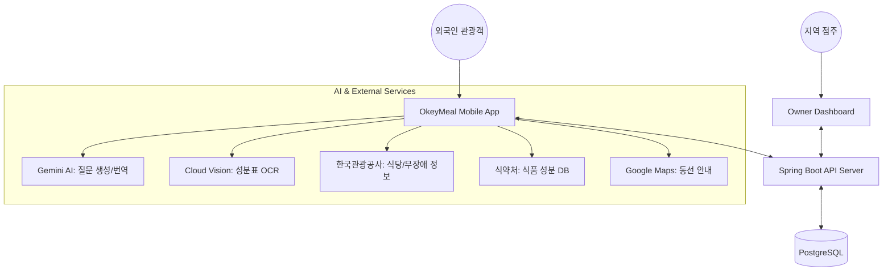

| 항목 | 내용 |
| :--- | :--- |
| **문서 제목** | OkeyMeal(오키밀) 프로젝트 기획안 |
| **파일명** | okeyMeal_planning_v1.0.md |
| **버전** | v1.0 |
| **작성일** | 2026-04-15 |
| **작성자** | Documentation Agent |

# 1. 프로젝트 개요 (Overview)

### 1.1 프로젝트 미션
* **"Safe Food, Warm Welcome"**
* 외국인 관광객이 식당 메뉴부터 가공식품까지 식이 제약과 언어 장벽 없이 한국의 미식을 안전하게 경험하는 환경 구축.

### 1.2 브랜드 아이덴티티 (스눙스터)
* **컨셉:** 따뜻함이 식지 않는 세계의 숭늉 정령 '스눙스터'가 에이전트로 활동.
* **상징성:** 관광객의 고민을 해결하는 완벽한 열쇠(Key)가 되어 "오키(Okey)!"라며 안심시켜 주는 조력자.

### 1.3 타겟 고객 및 지역
* **타겟 고객:** 
    - 방한 외국인 관광객 (알레르기, 비건, 할랄 등 식이 제약 보유)
    - 지역 소상공인 (외국어 응대 및 식이 제약 대응 부담 보유)
* **초기 타겟 지역:** 제주도 (MVP 단계)

---

# 2. 시스템 범위 (System Scope)

---

# 3. 요구사항 분류 및 목록

### 3.1 기능 요구사항 (Functional Requirements)
| ID | 요구사항명 | 상세 설명 | 우선순위 |
| :--- | :--- | :--- | :--- |
| **F-01** | 안심 식당 탐색 | 관광공사 API 연동, 식이 제약 및 무장애 필터링 제공 | High |
| **F-02** | 개인화 프로필 | 알레르기, 종교, 신념에 따른 식이 제약 설정 기능 | High |
| **F-03** | AI 사전 확인 | Gemini 기반 점주용 다국어 질문 생성 및 전달 | High |
| **F-04** | AI 렌즈 (Lens) | 가공식품 성분표 OCR 스캔 및 위험 성분 판별 | High |
| **F-05** | 소통 중재 | 카카오톡/SMS 연동 점주 간편 응답 폼 제공 | Medium |
| **F-06** | 안심 동선 추천 | Google Maps 기반 무장애/교통약자 최적 루트 안내 | Medium |
| **F-07** | 예약/관리 | 클라이언트 예약 신청 및 점주용 승인 대시보드 | Medium |

### 3.2 비기능 요구사항 (Non-functional Requirements)
| ID | 분류 | 요구사항 상세 |
| :--- | :--- | :--- |
| **NF-01** | 다국어 지원 | 영어, 중국어(간/번), 일본어, 한국어 인터페이스 지원 |
| **NF-02** | 응답 성능 | AI 분석 및 번역 결과 3초 이내 렌더링 지향 |
| **NF-03** | 디자인 표준 | '스눙스터' 디자인 토큰 및 WCAG AA 명도 대비 준수 |
| **NF-04** | 데이터 정확성 | 식약처 및 공공데이터 기반의 검증된 성분 정보 제공 |
| **NF-05** | 확장성 | 향후 타 지역(서울, 부산 등) 확장이 용이한 구조 설계 |

---

# 4. 사용자 유형 정의

1. **외국인 관광객 (User)**
   - 앱을 통해 식이 제약에 맞는 식당을 찾고, 가공식품 성분을 확인하며 예약을 진행하는 주체.
2. **지역 소상공인 (Owner)**
   - AI가 생성한 질문에 간편 응답하고, 예약 현황을 관리하는 점주.
3. **시스템 관리자 (Admin)**
   - 전체 예약 현황 모니터링 및 공공데이터 업데이트 관리.

---

# 5. 핵심 기능 상세 (Epics)

### Epic 1. 안심 식당 탐색
- 한국관광공사 API 연동을 통한 다국어 식당 리스트 확보.
- 초개인화 프로필 기반 위험 성분 배지 노출.

### Epic 2. AI 사전 확인 및 소통
- **Gemini 에이전트:** 사용자의 제약 조건을 분석하여 점주에게 물어볼 맞춤형 질문 자동 생성.
- **마찰 제로 응답:** 점주는 앱 설치 없이 웹 폼이나 SMS를 통해 간편하게 수용 여부 회신.

### Epic 3. 가공식품 성분표 AI 렌즈
- **OCR 텍스트 추출:** Cloud Vision API를 활용해 복잡한 성분표 이미지 데이터화.
- **위험도 판별:** 식약처 DB와 대조하여 위험 성분 강조 및 모국어 해설 제공.

---

# 6. 기술 스택 및 디자인 시스템

### 6.1 기술 스택
- **Frontend:** React 18+, Vite 6, FSD 구조, Zustand, Tailwind CSS
- **Backend:** Spring Boot 3.4.x (Java 21), PostgreSQL 16.x, Spring Security + JWT
- **AI/Cloud:** Google Gemini API, Cloud Vision API, Docker, GitHub Actions

### 6.2 디자인 시스템 (스눙스터 토큰)
- **Shape:** 1:1 비율 둥근 사각형 곡률 적용
- **Color Variables:**
    - `--color-body`: `#F7C96A` (스눙스터 바디)
    - `--color-border`: `#D88A3B` (테두리)
    - `--color-outline`: `#7A4A1A` (윤곽선)
    - `--color-point`: `#F9A88F` (포인트)

---

# 7. 요구사항 추적 매트릭스 (RTM)

| 기능 ID | Epic ID | 연관 기술 모듈 | 검증 방법 |
| :--- | :--- | :--- | :--- |
| F-01 | Epic 1 | Tour API, Maps API | 지역별 식당 검색 필터 테스트 |
| F-03 | Epic 2 | Gemini API, SMS/Kakao | 다국어 질문 생성 및 응답 수신 테스트 |
| F-04 | Epic 3 | Cloud Vision, Food DB | 성분표 스캔 정확도 및 판별 로직 검증 |

---

| 버전 | 날짜 | 변경 내용 | 작성자 |
| :--- | :--- | :--- | :--- |
| v1.0 | 2026-04-15 | 문서 초기 생성 및 기획 데이터 구조화 | Documentation Agent |
